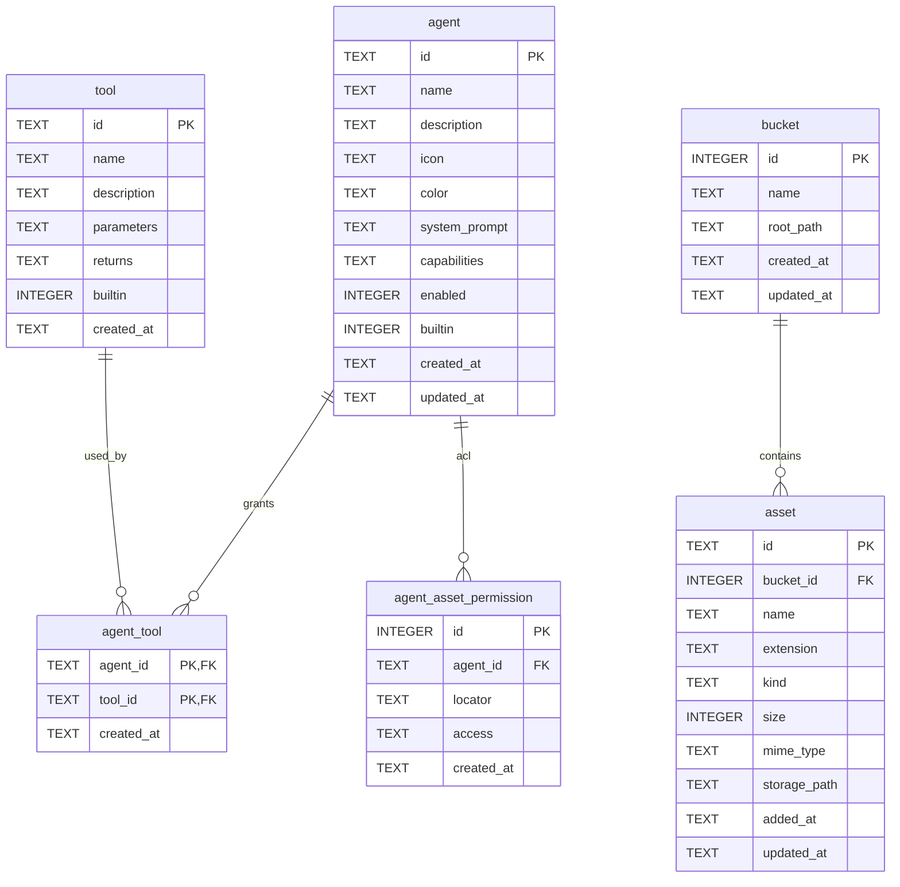

# Agent 模块设计

本文给出 Agent 模块的后端接口设计与数据库结构设计，作为实现的依据。设计沿用
Anki 模块既有的分层与命名习惯，保证两模块风格一致。

## 1. 范围与分层

### 1.1 模块职责

- Agent 的配置管理：名称、描述、展示信息、能力标签、使能状态、内置标记。一个 Agent
  默认对应一个学科或课程（数学 Agent、英语 Agent、操作系统 Agent），因此不设独立的
  学科字段。
- Agent 的工具授权：一个 Agent 可调用哪些工具。
- Agent 的资产访问控制（ACL）：对结构化资源定位符的读/写权限。
- 工具抽象与注册表：以结构化 id 描述工具，参数与返回值使用 JSON Schema。
- 权限模块：所有工具调用先经过权限判定。
- 非结构化资产：bucket（目录映射）与资产元数据。

会话（chat）属于独立的会话模块，本文只定义它与工具调用之间的边界，不展开其存储
与编排实现。

### 1.2 分层结构

沿用 Anki 模块的 `interface / repository / service / controller` 四层：

```
src-tauri/src/
├── interface/
│   ├── error.rs          # 共享 ApiError
│   ├── agent.rs          # Agent 相关 DTO
│   └── asset.rs          # 资产、bucket 相关 DTO
├── repository/
│   ├── agent.rs          # agent / agent_tool / agent_asset_permission 数据访问
│   ├── bucket.rs         # bucket 数据访问
│   └── asset.rs          # asset 元数据数据访问
├── service/
│   ├── agent.rs          # Agent 业务服务
│   ├── asset.rs          # 资产业务服务（文件读写 + 元数据）
│   ├── permission.rs     # 权限模块（定位符解析、ACL 匹配）
│   └── tool/
│       ├── mod.rs        # Tool trait、ToolRegistry、ToolContext、调用结果
│       ├── anki.rs       # Anki 工具
│       ├── asset.rs      # 非结构化资产工具
│       └── ask.rs        # 反问用户工具
└── controller/
    ├── agent.rs          # Agent 命令
    ├── asset.rs          # 资产与 bucket 命令
    └── mod.rs            # 汇总 controller_handlers!
```

`AppState` 新增 `agent: AgentService`。`AgentService` 持有数据库连接、`ToolRegistry`
与 `ConfigHandle`，在启动时构建一次，与 `AnkiService` 并列。

## 2. 数据库设计

### 2.1 迁移策略

`repository::db::migrate` 每次启动都会重放全部迁移（`db.rs:29`），因此每个迁移文件都
必须可重复执行。SQLite 不支持 `ALTER TABLE ... ADD COLUMN IF NOT EXISTS`，在不引入
迁移记录表的前提下，函数式幂等只有一种表达方式：把新增列直接写进基础 `CREATE TABLE`
定义。据此约定：

1. 卡片调度列 `algorithm`、`scheduler_state` 已并入 `000001.sql` 的 `CREATE TABLE
   card`，原先用裸 `ALTER TABLE` 的迁移文件已删除。当前尚无持久化数据库，直接收敛
   基础定义为完整结构最简洁，变更过程由 git 历史保留。
2. 本次新增的 `000002.sql` 全部使用 `CREATE TABLE IF NOT EXISTS`、`CREATE INDEX IF NOT
   EXISTS` 与 `INSERT OR IGNORE`，重放安全。
3. 后续迁移只使用幂等语句；新增列一律合并进对应表的 `CREATE TABLE IF NOT EXISTS`
   定义，不再使用裸 `ALTER TABLE`。

### 2.2 ER 概览



### 2.3 迁移 000002.sql

```sql
-- Agent 模块基础表结构：Agent、工具、授权、ACL、bucket 与资产。

-- Agent 定义。
CREATE TABLE IF NOT EXISTS agent (
    id            TEXT PRIMARY KEY,
    name          TEXT    NOT NULL,
    description   TEXT    NOT NULL DEFAULT '',
    icon          TEXT    NOT NULL DEFAULT 'AI',
    color         TEXT    NOT NULL DEFAULT '',
    system_prompt TEXT    NOT NULL DEFAULT '',
    capabilities  TEXT    NOT NULL DEFAULT '[]',   -- JSON 字符串数组
    enabled       INTEGER NOT NULL DEFAULT 1,
    builtin       INTEGER NOT NULL DEFAULT 0,
    created_at    TEXT    NOT NULL,
    updated_at    TEXT    NOT NULL
);

-- 工具目录：代码注册表在启动时同步此表，作为工具元数据与授权外键的落点。
CREATE TABLE IF NOT EXISTS tool (
    id          TEXT PRIMARY KEY,                    -- 结构化 id，如 anki.add_card
    name        TEXT    NOT NULL,
    description TEXT    NOT NULL,
    parameters  TEXT    NOT NULL DEFAULT '{}',       -- JSON Schema
    returns     TEXT    NOT NULL DEFAULT '{}',       -- JSON Schema
    builtin     INTEGER NOT NULL DEFAULT 1,
    created_at  TEXT    NOT NULL
);

-- Agent 可用工具（工具级授权）。
CREATE TABLE IF NOT EXISTS agent_tool (
    agent_id   TEXT NOT NULL,
    tool_id    TEXT NOT NULL,
    created_at TEXT NOT NULL,
    PRIMARY KEY (agent_id, tool_id),
    FOREIGN KEY (agent_id) REFERENCES agent (id) ON DELETE CASCADE,
    FOREIGN KEY (tool_id)  REFERENCES tool  (id) ON DELETE CASCADE
);

CREATE INDEX IF NOT EXISTS idx_agent_tool_agent ON agent_tool (agent_id);

-- 结构化资产访问权限（资产级 ACL）。
CREATE TABLE IF NOT EXISTS agent_asset_permission (
    id         INTEGER PRIMARY KEY AUTOINCREMENT,
    agent_id   TEXT    NOT NULL,
    locator    TEXT    NOT NULL,                     -- anki://..., file://...
    access     TEXT    NOT NULL
               CHECK (access IN ('read', 'write', 'read_write')),
    created_at TEXT    NOT NULL,
    UNIQUE (agent_id, locator),
    FOREIGN KEY (agent_id) REFERENCES agent (id) ON DELETE CASCADE
);

CREATE INDEX IF NOT EXISTS idx_agent_acl_agent ON agent_asset_permission (agent_id);

-- 非结构化资产 bucket：名称 -> 文件系统目录。
CREATE TABLE IF NOT EXISTS bucket (
    id         INTEGER PRIMARY KEY AUTOINCREMENT,
    name       TEXT    NOT NULL UNIQUE,
    root_path  TEXT    NOT NULL,
    created_at TEXT    NOT NULL,
    updated_at TEXT    NOT NULL
);

-- 非结构化资产元数据。
CREATE TABLE IF NOT EXISTS asset (
    id           TEXT PRIMARY KEY,
    bucket_id    INTEGER,
    name         TEXT    NOT NULL,
    extension    TEXT    NOT NULL DEFAULT '',
    kind         TEXT    NOT NULL DEFAULT 'document'
                 CHECK (kind IN ('pdf', 'slides', 'note', 'image', 'document')),
    size         INTEGER NOT NULL DEFAULT 0,
    mime_type    TEXT    NOT NULL DEFAULT 'application/octet-stream',
    storage_path TEXT    NOT NULL DEFAULT '',        -- 相对 bucket.root_path
    added_at     TEXT    NOT NULL,
    updated_at   TEXT    NOT NULL,
    FOREIGN KEY (bucket_id) REFERENCES bucket (id) ON DELETE SET NULL
);

CREATE INDEX IF NOT EXISTS idx_asset_bucket  ON asset (bucket_id);

-- 内置工具播种（启动时由注册表再同步一次，保持描述最新）。
INSERT OR IGNORE INTO tool (id, name, description, parameters, returns, builtin, created_at) VALUES
  ('anki.list_decks',  '列出牌组',   '列出指定牌组下的子牌组。',        '{}', '{}', 1, datetime('now')),
  ('anki.list_cards',  '列出卡片',   '列出牌组下的卡片，可按条件过滤。', '{}', '{}', 1, datetime('now')),
  ('anki.get_card',    '读取卡片',   '按 id 读取单张卡片。',            '{}', '{}', 1, datetime('now')),
  ('anki.search_cards','搜索卡片',   '按关键字搜索卡片。',              '{}', '{}', 1, datetime('now')),
  ('anki.add_deck',    '新增牌组',   '创建牌组。',                      '{}', '{}', 1, datetime('now')),
  ('anki.add_card',    '新增卡片',   '向牌组新增卡片。',                '{}', '{}', 1, datetime('now')),
  ('anki.update_card', '修改卡片',   '修改卡片正面或背面。',            '{}', '{}', 1, datetime('now')),
  ('anki.move_card',   '移动卡片',   '把卡片移动到目标牌组。',          '{}', '{}', 1, datetime('now')),
  ('anki.grade_card',  '作答卡片',   '记录一次作答并推进复习计划。',    '{}', '{}', 1, datetime('now')),
  ('anki.delete_card', '删除卡片',   '删除单张卡片。',                  '{}', '{}', 1, datetime('now')),
  ('asset.list',       '列出资产',   '列出可访问的非结构化资产。',      '{}', '{}', 1, datetime('now')),
  ('asset.search',     '检索资产',   '在知识库中检索资产内容。',        '{}', '{}', 1, datetime('now')),
  ('asset.read',       '读取资产',   '读取资产文本内容。',              '{}', '{}', 1, datetime('now')),
  ('ask_question',     '反问用户',   '向用户提出澄清问题并等待回答。',  '{}', '{}', 1, datetime('now'));

-- 内置 Agent 播种。
INSERT OR IGNORE INTO agent
  (id, name, description, icon, color, system_prompt, capabilities, enabled, builtin, created_at, updated_at)
VALUES
  ('math', '数学 Agent', '数学问题、公式推导与解题思路',
   '∑', 'linear-gradient(135deg, #438fff, #5c6df5)',
   '你是数学学习助手，负责题目解析、知识点拆解与错题复盘。',
   '["题目解析","知识点拆解","错题复盘"]', 1, 1, datetime('now'), datetime('now')),
  ('english', '英语 Agent', '英语词汇、语法、翻译与口语练习',
   'En', 'linear-gradient(135deg, #26b7bf, #16a5a8)',
   '你是英语学习助手，负责词汇讲解、句子分析与翻译训练。',
   '["词汇讲解","句子分析","口语练习"]', 1, 1, datetime('now'), datetime('now'));

-- 内置 Agent 的工具授权。
INSERT OR IGNORE INTO agent_tool (agent_id, tool_id, created_at)
SELECT a.id, t.id, datetime('now')
FROM agent a JOIN tool t
WHERE a.builtin = 1;

-- 内置 Agent 的资产 ACL：全部牌组读写，notes bucket 只读。
INSERT OR IGNORE INTO agent_asset_permission (agent_id, locator, access, created_at)
SELECT id, 'anki://', 'read_write', datetime('now') FROM agent WHERE builtin = 1;
INSERT OR IGNORE INTO agent_asset_permission (agent_id, locator, access, created_at)
SELECT id, 'file://notes/', 'read', datetime('now') FROM agent WHERE builtin = 1;
```

### 2.4 运行时初始化

- 启动时调用 `tool::registry().sync(&conn)`：把代码注册表的工具 `INSERT ... ON CONFLICT(id)
DO UPDATE` 写入 `tool` 表，保证描述与 Schema 始终与代码一致。
- 启动时确保存在默认 bucket：`notes` 指向应用数据目录下的 `assets/notes`，已存在则跳过。
- 自定义 Agent 的 id 由服务端生成，采用 `agent-<unix_millis>-<rand>` 形式，无需新增依赖；
  后续如需更强唯一性可引入 `uuid`。
- 不设学科字段：Agent 本身即学科/课程的载体，资产所属的学科由所属 bucket 与 Agent 的
  ACL 表达。

## 3. 后端接口设计

### 3.1 通用约定

- DTO 使用 `serde`，字段序列化统一 `camelCase`，与前端 `types/` 保持一致。
- 枚举使用 `snake_case`，与 Anki 模块一致。
- 新模块统一返回 `ApiError { code, message }`；Anki 模块的 `AnkiError` 结构相同，后续可
  平滑迁移到 `ApiError`。

```rust
// interface/error.rs
pub struct ApiError {
    pub code: String,
    pub message: String,
}
```

### 3.2 Agent 接口类型（interface/agent.rs）

```rust
/// 资产访问权限类型。
#[serde(rename_all = "snake_case")]
pub enum AccessMode { Read, Write, ReadWrite }

/// Agent 概览，与前端 AgentInfo 一一对应。
#[serde(rename_all = "camelCase")]
pub struct AgentInfo {
    pub id: String,
    pub name: String,
    pub description: String,
    pub icon: String,
    pub color: String,
    pub capabilities: Vec<String>,
    pub enabled: bool,
    pub builtin: bool,
}

/// 创建/更新输入。前端当前只发送前 3 个字段，其余为可选扩展字段。
#[serde(rename_all = "camelCase")]
pub struct AgentConfigInput {
    pub name: String,
    pub description: String,
    pub capabilities: Vec<String>,
    #[serde(default)] pub icon: Option<String>,
    #[serde(default)] pub color: Option<String>,
    #[serde(default)] pub system_prompt: Option<String>,
    #[serde(default)] pub tool_ids: Option<Vec<String>>,
    #[serde(default)] pub permissions: Option<Vec<AssetPermissionInput>>,
}

/// 资产级 ACL 项。
#[serde(rename_all = "camelCase")]
pub struct AssetPermissionInput {
    pub locator: String,
    pub access: AccessMode,
}

#[serde(rename_all = "camelCase")]
pub struct AssetPermission {
    pub locator: String,
    pub access: AccessMode,
}

/// 工具元数据。
#[serde(rename_all = "camelCase")]
pub struct ToolInfo {
    pub id: String,
    pub name: String,
    pub description: String,
    pub parameters: serde_json::Value,  // JSON Schema
    pub returns: serde_json::Value,     // JSON Schema
}

/// 会话上下文面板中的资产条目。
#[serde(rename_all = "snake_case")]
pub enum AgentContextAssetType { Document, Collection, Deck }

#[serde(rename_all = "camelCase")]
pub struct AgentContextAsset {
    pub id: String,
    pub name: String,
    #[serde(rename = "type")]
    pub asset_type: AgentContextAssetType,
    pub access: String,
}

#[serde(rename_all = "camelCase")]
pub struct AgentContext {
    pub assets: Vec<AgentContextAsset>,
}

/// 工具调用请求与结果。
#[serde(rename_all = "camelCase")]
pub struct ToolCall {
    pub agent_id: String,
    pub tool_id: String,
    pub arguments: serde_json::Value,
}

#[serde(rename_all = "camelCase")]
pub struct ToolResult {
    pub tool_id: String,
    pub status: ToolStatus,             // completed / awaiting_user
    pub output: serde_json::Value,
}
```

### 3.3 资产接口类型（interface/asset.rs）

```rust
#[serde(rename_all = "snake_case")]
pub enum AssetKind { Pdf, Slides, Note, Image, Document }

#[serde(rename_all = "snake_case")]
pub enum AssetSort { Updated, Name, Size }

#[serde(rename_all = "camelCase")]
pub struct LearningAsset {
    pub id: String,
    pub name: String,
    pub extension: String,
    pub type_label: String,
    pub kind: AssetKind,
    pub size: i64,
    pub mime_type: String,
    pub added_at: String,
    pub url: Option<String>,
}

#[serde(rename_all = "camelCase")]
pub struct AssetQuery {
    pub sort_by: Option<AssetSort>,
}

#[serde(rename_all = "camelCase")]
pub struct UploadAssetRequest {
    pub name: String,
    pub size: i64,
    pub mime_type: String,
    pub content_base64: String,
}

#[serde(rename_all = "camelCase")]
pub struct UploadedImage { pub name: String, pub url: String }

#[serde(rename_all = "camelCase")]
pub struct Bucket {
    pub id: i64,
    pub name: String,
    pub root_path: String,
    pub asset_count: u32,
    pub created_at: String,
    pub updated_at: String,
}
```

资产文件访问方案：在 `tauri.conf.json` 的 `app.security.assetProtocol` 开启并按 bucket
根目录配置 scope，`asset_get_url` 返回绝对路径，前端用 `convertFileSrc` 转为可访问 URL；
图片插入复用同一机制。

### 3.4 Tauri 命令清单

Agent（controller/agent.rs）：

| 命令                          | 参数                      | 返回                | 说明                          |
| ----------------------------- | ------------------------- | ------------------- | ----------------------------- |
| `agent_list`                  | —                         | `AgentInfo[]`       | 列出全部 Agent                |
| `agent_get`                   | `agentId`                 | `AgentInfo`         | 读取单个 Agent                |
| `agent_create`                | `input: AgentConfigInput` | `AgentInfo`         | 创建自定义 Agent              |
| `agent_update`                | `agentId, input`          | `AgentInfo`         | 更新配置                      |
| `agent_delete`                | `agentId`                 | `()`                | 删除；内置 Agent 拒绝         |
| `agent_set_enabled`           | `agentId, enabled`        | `AgentInfo`         | 启用/停用                     |
| `agent_get_context`           | `agentId`                 | `AgentContext`      | 会话上下文面板数据            |
| `agent_list_tools`            | `agentId?`                | `ToolInfo[]`        | 工具目录，可按 Agent 授权过滤 |
| `agent_set_tools`             | `agentId, toolIds`        | `ToolInfo[]`        | 设置 Agent 工具授权           |
| `agent_get_asset_permissions` | `agentId`                 | `AssetPermission[]` | 读取 ACL                      |
| `agent_set_asset_permissions` | `agentId, permissions`    | `AssetPermission[]` | 覆盖式设置 ACL                |

资产与 bucket（controller/asset.rs）：

| 命令                  | 参数                        | 返回              |
| --------------------- | --------------------------- | ----------------- |
| `asset_list`          | `query: AssetQuery`         | `LearningAsset[]` |
| `asset_upload`        | `input: UploadAssetRequest` | `LearningAsset`   |
| `asset_get_url`       | `assetId`                   | `string`          |
| `asset_delete`        | `assetId`                   | `()`              |
| `asset_upload_image`  | `input`                     | `UploadedImage`   |
| `bucket_list`         | —                           | `Bucket[]`        |
| `bucket_create`       | `name, rootPath`            | `Bucket`          |
| `bucket_update`       | `id, name?, rootPath?`      | `Bucket`          |
| `bucket_delete`       | `id`                        | `()`              |

工具调用（controller/agent.rs，供会话编排使用，也可直接暴露给前端调试）：

| 命令                | 参数             | 返回         |
| ------------------- | ---------------- | ------------ |
| `agent_invoke_tool` | `call: ToolCall` | `ToolResult` |

`agent_invoke_tool` 依次完成：Agent 使能校验、工具授权校验、资产 ACL 校验，全部通过后
交给工具执行。任一步失败返回 `permission_denied`，不产生副作用。

### 3.5 错误码

| code                  | 场景                                |
| --------------------- | ----------------------------------- |
| `not_found`           | Agent / 工具 / 资产 / bucket 不存在 |
| `invalid_input`       | 必填字段缺失、能力标签为空          |
| `invalid_path`        | bucket 目录不存在、locator 语法错误 |
| `conflict`            | 名称重复（bucket、Agent）           |
| `builtin_protected`   | 尝试删除内置 Agent                  |
| `tool_not_granted`    | 工具未授权给该 Agent                |
| `permission_denied`   | 资产 ACL 不允许该操作               |
| `agent_disabled`      | Agent 已停用                        |
| `internal` / `db`     | 内部与数据库错误                    |

## 4. 工具抽象

采用注册表 + 策略 + 命令三种模式的组合：工具是命令对象，`Tool` trait 是策略接口，
`ToolRegistry` 负责按 id 查找。

```rust
// service/tool/mod.rs
pub struct ToolContext<'a> {
    pub conn: &'a rusqlite::Connection,
    pub agent_id: &'a str,
}

/// 工具向权限模块声明的访问需求。
pub struct AccessRequest {
    pub locator: ResourceLocator,
    pub mode: AccessMode,
}

pub trait Tool: Send + Sync {
    fn id(&self) -> &'static str;
    fn name(&self) -> &'static str;
    fn description(&self) -> &'static str;
    fn parameters(&self) -> serde_json::Value;   // JSON Schema
    fn returns(&self) -> serde_json::Value;      // JSON Schema
    /// 根据实参推导需要的资产访问权限。
    fn access_requests(&self, args: &serde_json::Value) -> Result<Vec<AccessRequest>, ApiError>;
    fn invoke(&self, ctx: &ToolContext, args: serde_json::Value)
        -> Result<ToolOutput, ApiError>;
}

pub enum ToolOutput {
    Completed(serde_json::Value),
    AwaitUser { question: String },
}

pub struct ToolRegistry { tools: HashMap<&'static str, Arc<dyn Tool>> }

impl ToolRegistry {
    pub fn get(&self, id: &str) -> Option<Arc<dyn Tool>>;
    pub fn list(&self) -> Vec<Arc<dyn Tool>>;
    pub fn sync(&self, conn: &rusqlite::Connection) -> Result<(), ApiError>;
}
```

内置工具：

- `anki.*`：读写牌组与卡片，复用 `AnkiService` 的用例，不绕过调度逻辑。
- `asset.list` / `asset.search` / `asset.read`：读取 bucket 内文件与元数据。
- `ask_question`：返回 `ToolOutput::AwaitUser`，由会话编排暂停等待用户输入；该工具不需要
  资产权限。

新增工具只需实现 `Tool` 并在注册表登记，无需改动权限模块与命令层。

## 5. 权限模块

### 5.1 资源定位符

```
anki://<deck-path>          牌组子树，如 anki://数学/极限
file://<bucket>/<path>       bucket 内的文件或目录，路径以 / 结尾表示目录
```

`anki://path/to/a/1` 这类以数字结尾的写法在解析时归一化为 `anki://card/1`，
`anki://path/to/a` 按牌组子树处理。

### 5.2 ACL 匹配规则

- 先比较 scheme（`anki` / `file`）与 bucket 名，必须一致。
- 路径匹配采用分段前缀：条目 `anki://a` 覆盖 `anki://a`、`anki://a/b`，但 `anki://ab`
  不匹配。
- `file://bucket/` 覆盖该 bucket 全部内容；`file://bucket/docs` 覆盖 `docs` 及其后代。
- 权限覆盖：`read_write` 覆盖 `read` 与 `write`；`read` 只覆盖 `read`；`write` 只覆盖
  `write`。
- 命中失败返回 `permission_denied`，并在 message 中指出缺失的 locator 与 mode。

### 5.3 调用前置检查流程

```
agent_invoke_tool(agentId, toolId, args)
  1. Agent 存在且 enabled                -> 否则 agent_disabled / not_found
  2. agent_tool 中存在 (agentId,toolId)   -> 否则 tool_not_granted
  3. Tool.access_requests(args) 逐条经 ACL 判定 -> 否则 permission_denied
  4. Tool.invoke(ctx, args)
```

工具授权与资产 ACL 都由前端按 Agent 具体配置：工具授权决定「能调用哪些工具」，资产 ACL
决定「能读写哪些资源」，两者共同构成完整的权限判定，`ask_question` 不需要资产权限。

### 5.4 会话上下文

`agent_get_context` 由 ACL 反推展示条目：`anki://<path>` 解析为 deck 条目（`anki://` 根
展开为「全部牌组」），`file://<bucket>/<path>` 解析为 document 条目，笔记集合映射为
collection 条目，供 `ChatContextPanel` 展示。

## 6. 与前端契约的差异

前端已有 `services/agent.ts`、`services/assets.ts`，其中大部分命令与本文设计一致，存在
以下缺口，建议补充：

1. `AgentInfo` 与 `AgentConfigInput` 需移除 `subject`；`AgentConfigInput` 还要新增可选的
   `toolIds`、`permissions`、`systemPrompt`，`AgentManager` 的权限弹窗可据此编辑工具
   授权与资产 ACL。
2. `services/agent.ts` 缺少 `agent_list_tools`、`agent_set_tools`、
   `agent_get_asset_permissions`、`agent_set_asset_permissions`。
3. `services/assets.ts`：`LearningAsset`、`AssetQuery`、`UploadAssetRequest` 需移除
   `subject`，删除 `listAssetSubjects`；`AssetManager` 的学科筛选与上传表单相应调整。
   同时补充 bucket 管理与 `asset_upload_image`，`AnkiCreator` 的图片插入依赖后者。
4. `services/agent.ts` 的 `getAgentPermissions`、`updateAgentPermissions`，以及
   `AgentPermission`、`AgentContext.permissions` 需删除；权限改为按 Agent 直接配置工具
   授权（`agent_list_tools` / `agent_set_tools`）与资产 ACL（`agent_get_asset_permissions`
   / `agent_set_asset_permissions`）。`AgentInfo.capabilities` 可直接映射。

在上述命令补齐前，前端可继续使用 `mocks/agents.ts`、`mocks/assets.ts` 的假数据。

## 7. 实施顺序

1. `000002.sql` 迁移（全部使用幂等语句）与 `000001.sql` 调度列的收敛。
2. `interface/agent.rs`、`interface/asset.rs`、`interface/error.rs`。
3. `repository/` 各数据访问模块与单元测试。
4. `service/agent.rs`、`service/asset.rs` 与用例测试。
5. `service/tool/` 注册表与内置工具。
6. `service/permission.rs` 权限模块与边界测试。
7. `controller/` 命令、`AppState` 接线与 `controller_handlers!` 汇总。
