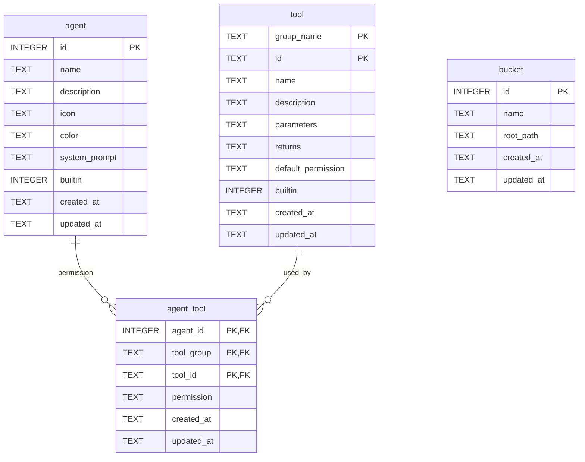

# Agent 模块设计

本文给出 Agent 模块本阶段的后端设计，作为实现的依据。设计沿用 Anki 模块既有的
`interface / repository / service / controller` 分层与命名习惯，保证两个模块风格一致。

## 1. 设计目标

### 1.1 本阶段目标

1. **Agent 与工具元数据管理**
    - Agent：名称、描述、展示信息（图标、配色）、系统提示词、内置标记的增删改查。
    - 工具：以「工具组 + id」标识，描述名称、描述、参数（JSON Schema）与返回值
      （JSON Schema）。工具目录在内置迁移中播种，运行期以数据库为唯一真相。
2. **学习资产 repository 的跨平台文件系统兼容**
    - bucket（名称 -> 文件系统目录）元数据落库。
    - 文件系统细节收敛到 repository 的单一适配层，统一处理 Windows 与 Linux 的路径分隔符、
      盘符、大小写、创建时间可用性、`\\?\` 前缀与符号链接等差异。
    - 对上层只暴露「bucket + 以 `/` 分隔的相对路径」这一层语义，业务层不接触 `std::fs`。
3. **Agent 对工具的权限**
    - 权限分为三级：**允许（allow）/ 询问（ask）/ 拒绝（deny）**，按 `(agent, 工具)` 精确配置。
    - 提供权限判定接口：给定 Agent 与工具，返回三级权限之一。本阶段只负责存储与判定，
      「询问」所需的用户确认交互由后续的会话循环实现。

### 1.2 本阶段不做

- **Agent 会话与 Agent 循环**：会话存储、消息编排、多轮工具调用循环均不在本阶段，本文只预留
  权限判定接口供其调用。
- **工具的具体实现**：本阶段只管理工具元数据，不实现任何工具的调用逻辑。
- **Agent 访问学习资产的权限**：资产级读写 ACL 不在本阶段，权限只覆盖「Agent 能否调用某工具」。

### 1.3 总体分层

```
src-tauri/src/
├── interface/            # 跨层共享的 DTO 与错误
├── repository/           # 数据访问；fs.rs 是唯一接触文件系统的位置
├── service/              # 业务编排；工具权限判定与工具执行扩展点
└── controller/           # Tauri 命令，仅做参数透传
```

依赖方向单向：`controller -> service -> repository -> db / fs`，`interface` 被各层引用。

---

## 2. 将实现的接口

### 2.1 通用约定

- DTO 使用 `serde`，字段序列化统一 `camelCase`，与前端 `src/types/` 保持一致。
- 枚举使用 `snake_case`。
- 资源引用不使用 `scheme://` 定位符：文件资产就是 `/<bucket>/<relative-path>`，Anki 牌组就是
  `/path/to/deck`，两者都是普通路径字符串。
- 新模块统一返回 `ApiError { code, message }`，结构与既有 `AnkiError` 相同，便于后续平滑迁移。

```rust
// interface/error.rs
pub struct ApiError { pub code: String, pub message: String }

impl ApiError {
    pub fn new(code: impl Into<String>, message: impl Into<String>) -> Self;
    pub fn not_found(m: impl Into<String>) -> Self;          // not_found
    pub fn invalid_input(m: impl Into<String>) -> Self;      // invalid_input
    pub fn invalid_path(m: impl Into<String>) -> Self;       // invalid_path
    pub fn conflict(m: impl Into<String>) -> Self;           // conflict
    pub fn builtin_protected(m: impl Into<String>) -> Self;  // builtin_protected
    pub fn tool_denied(m: impl Into<String>) -> Self;        // tool_denied
    pub fn internal(m: impl Into<String>) -> Self;           // internal
}

impl From<rusqlite::Error> for ApiError; // -> "db"
impl From<crate::interface::anki::AnkiError> for ApiError;
```

### 2.2 Agent 与工具类型（interface/agent.rs）

```rust
/// 工具权限三级：允许 / 询问 / 拒绝。
#[derive(Serialize, Deserialize, Clone, Copy, PartialEq, Eq, Debug)]
#[serde(rename_all = "snake_case")]
pub enum ToolPermission { Allow, Ask, Deny }

/// Agent 概览。
pub struct AgentInfo {
    pub id: i64,
    pub name: String,
    pub description: String,
    pub icon: String,
    pub color: String,
    pub builtin: bool,
}

/// 创建 / 更新输入；可选字段缺省表示沿用原值。
pub struct AgentConfigInput {
    pub name: String,
    pub description: String,
    pub icon: Option<String>,
    pub color: Option<String>,
    pub system_prompt: Option<String>,
    /// 覆盖式设置该 Agent 的工具权限；`None` 表示不改动。
    pub tool_permissions: Option<Vec<AgentToolPermissionInput>>,
}

/// `tool_id` 为 `<group>.<id>` 形式的完整引用，如 `anki.add_card`。
pub struct AgentToolPermissionInput {
    pub tool_id: String,
    pub permission: ToolPermission,
}

/// 工具元数据。
pub struct ToolInfo {
    pub group: String,
    pub id: String,
    pub name: String,
    pub description: String,
    pub parameters: serde_json::Value, // JSON Schema
    pub returns: serde_json::Value,    // JSON Schema
    /// 新增授权时的默认级别，内置迁移播种时写入。
    pub default_permission: ToolPermission,
}

/// 某 Agent 对某工具的生效权限（工具元数据 + 级别）。
pub struct AgentToolPermission {
    pub tool: ToolInfo,
    pub permission: ToolPermission,
}

/// 工具组概览。
pub struct ToolGroup {
    pub name: String,       // 组名，如 anki / asset / user
    pub tool_count: u32,    // 组内工具数量
}
```

### 2.3 资产类型（interface/asset.rs）

```rust
pub enum AssetKind { Pdf, Slides, Note, Image, Document, Other }
pub enum AssetSort { Updated, Name, Size }

/// bucket 目录内文件在内存中的投影，不落库。
pub struct LearningAsset {
    pub id: String,          // /<bucket>/<relative-path>
    pub name: String,
    pub extension: String,
    pub type_label: String,
    pub kind: AssetKind,
    pub size: i64,
    pub mime_type: String,
    pub added_at: String,    // RFC3339
    pub url: Option<String>,
}

pub struct AssetQuery {
    pub bucket: Option<String>,   // 限定 bucket；None 表示全部
    pub sort_by: Option<AssetSort>,
}

pub struct UploadAssetRequest {
    pub bucket: String,
    pub name: String,
    pub size: i64,
    pub mime_type: String,
    pub content_base64: String,
}

pub struct UploadImageRequest { pub name: String, pub mime_type: String, pub content_base64: String }
pub struct UploadedImage { pub name: String, pub url: String }

pub struct Bucket {
    pub id: i64,
    pub name: String,
    pub root_path: String,
    pub asset_count: u32,
    pub created_at: String,
    pub updated_at: String,
}
```

### 2.4 repository 接口

```rust
// repository/agent.rs —— Agent、工具目录、工具权限
pub fn list_agents(conn: &Connection) -> Result<Vec<AgentInfo>, ApiError>;
pub fn get_agent(conn: &Connection, agent_id: i64) -> Result<Option<AgentInfo>, ApiError>;
pub fn ensure_agent(conn: &Connection, agent_id: i64) -> Result<(), ApiError>;
pub fn name_exists(conn: &Connection, name: &str, exclude_id: Option<i64>) -> Result<bool, ApiError>;
pub fn insert_agent(conn: &Connection, name: &str, description: &str, icon: &str,
                    color: &str, system_prompt: &str) -> Result<AgentInfo, ApiError>;
pub fn update_agent(conn: &Connection, agent_id: i64, input: &AgentConfigInput) -> Result<AgentInfo, ApiError>;
pub fn delete_agent(conn: &Connection, agent_id: i64) -> Result<(), ApiError>; // 内置受保护

pub fn list_tools(conn: &Connection) -> Result<Vec<ToolInfo>, ApiError>;
pub fn list_tool_groups(conn: &Connection) -> Result<Vec<ToolGroup>, ApiError>;
pub fn get_tool(conn: &Connection, group: &str, id: &str) -> Result<Option<ToolInfo>, ApiError>;
pub fn resolve_permission(conn: &Connection, agent_id: i64, group: &str, id: &str)
    -> Result<ToolPermission, ApiError>;
pub fn set_tool_permission(conn: &Connection, agent_id: i64, group: &str, id: &str,
    permission: ToolPermission) -> Result<AgentToolPermission, ApiError>;
pub fn set_tool_permissions(conn: &Connection, agent_id: i64,
    items: &[AgentToolPermissionInput]) -> Result<Vec<AgentToolPermission>, ApiError>; // 覆盖式

// repository/bucket.rs —— bucket 表数据访问
pub fn list_buckets(conn: &Connection) -> Result<Vec<Bucket>, ApiError>;
pub fn get_bucket(conn: &Connection, bucket_id: i64) -> Result<Option<Bucket>, ApiError>;
pub fn find_bucket_by_name(conn: &Connection, name: &str) -> Result<Option<Bucket>, ApiError>;
pub fn create_bucket(conn: &Connection, name: &str, root_path: &str) -> Result<Bucket, ApiError>;
pub fn update_bucket(conn: &Connection, bucket_id: i64, name: Option<String>,
                     root_path: Option<String>) -> Result<Bucket, ApiError>;
pub fn delete_bucket(conn: &Connection, bucket_id: i64) -> Result<(), ApiError>; // 只删映射
```

> 工具目录与内置授权的播种属于数据库迁移逻辑，在 `000002.sql` 中一次完成，不在 repository
> 暴露 `sync_tools` / `seed_builtin_grants` 之类的运行期接口。

```rust
// repository/fs.rs —— 跨平台文件系统适配，唯一接触 std::fs / std::path 的模块
pub struct FileEntry {
    pub relative_path: String, // 统一以 '/' 分隔
    pub name: String,
    pub extension: String,
    pub size: i64,
    pub added_at: String,      // RFC3339：优先创建时间，回退修改时间
}

/// 校验 bucket 根目录存在且为目录。
pub fn validate_root(root: &str) -> Result<PathBuf, ApiError>;
/// 规范化相对路径（拒绝绝对路径与 `..`），统一 '/'。
pub fn normalize_relative(raw: &str) -> Result<String, ApiError>;
/// 解析为平台原生绝对路径，并确认仍在 bucket 根目录内。
pub fn resolve(bucket: &Bucket, relative: &str) -> Result<PathBuf, ApiError>;
/// 由绝对路径反推相对路径。
pub fn to_relative(root: &Path, path: &Path) -> Result<String, ApiError>;
pub fn scan(bucket: &Bucket) -> Result<Vec<FileEntry>, ApiError>;
pub fn stat(bucket: &Bucket, relative: &str) -> Result<FileEntry, ApiError>;
pub fn count(bucket: &Bucket) -> Result<u32, ApiError>;
pub fn read(bucket: &Bucket, relative: &str) -> Result<Vec<u8>, ApiError>;
pub fn write(bucket: &Bucket, relative: &str, content: &[u8]) -> Result<(), ApiError>;
pub fn delete(bucket: &Bucket, relative: &str) -> Result<(), ApiError>;
```

### 2.5 service 接口

```rust
// service/tool/mod.rs —— 工具引用与工具执行扩展点
/// `<group>.<id>` 形式的工具引用。
pub struct ToolKey { pub group: String, pub id: String }

impl ToolKey {
    pub fn parse(raw: &str) -> Result<Self, ApiError>; // 缺少 '.' 或段为空 -> invalid_input
}
impl std::fmt::Display for ToolKey; // "group.id"

/// 工具执行契约。本阶段不注册任何实现；工具元数据由迁移播种并落在 `tool` 表。
pub trait Tool: Send + Sync {
    fn key(&self) -> ToolKey;
}

pub struct ToolRegistry { /* HashMap<ToolKey, Arc<dyn Tool>> */ }
impl ToolRegistry {
    pub fn new() -> Self; // 本阶段为空
    pub fn get(&self, key: &ToolKey) -> Option<Arc<dyn Tool>>;
}

// service/agent.rs
pub struct AgentService { /* db: Arc<Mutex<Connection>>, registry: Arc<ToolRegistry>, config: ConfigHandle */ }

impl AgentService {
    pub fn new(db: Arc<Mutex<rusqlite::Connection>>, registry: Arc<ToolRegistry>, config: ConfigHandle) -> Self;

    pub fn list_agents(&self) -> Result<Vec<AgentInfo>, ApiError>;
    pub fn get_agent(&self, agent_id: i64) -> Result<AgentInfo, ApiError>;
    pub fn create_agent(&self, input: AgentConfigInput) -> Result<AgentInfo, ApiError>;
    pub fn update_agent(&self, agent_id: i64, input: AgentConfigInput) -> Result<AgentInfo, ApiError>;
    pub fn delete_agent(&self, agent_id: i64) -> Result<(), ApiError>;

    pub fn list_tools(&self) -> Result<Vec<ToolInfo>, ApiError>;
    pub fn list_tool_groups(&self) -> Result<Vec<ToolGroup>, ApiError>;
    pub fn get_tool_permissions(&self, agent_id: i64) -> Result<Vec<AgentToolPermission>, ApiError>;
    pub fn set_tool_permission(&self, agent_id: i64, tool_id: &str, p: ToolPermission)
        -> Result<AgentToolPermission, ApiError>;
    pub fn set_tool_permissions(&self, agent_id: i64, items: Vec<AgentToolPermissionInput>)
        -> Result<Vec<AgentToolPermission>, ApiError>;
    pub fn resolve_tool_permission(&self, agent_id: i64, tool_id: &str) -> Result<ToolPermission, ApiError>;
}

// service/permission.rs —— 工具权限判定
pub fn resolve(conn: &Connection, agent_id: i64, key: &ToolKey) -> Result<ToolPermission, ApiError>;
/// 供未来的会话循环调用：allow 直接放行，ask 等待用户确认，deny 返回 `tool_denied`。
pub fn ensure_callable(conn: &Connection, agent_id: i64, key: &ToolKey) -> Result<ToolPermission, ApiError>;

// service/asset.rs
pub struct AssetService { /* db: Arc<Mutex<Connection>> */ }

impl AssetService {
    pub fn new(db: Arc<Mutex<rusqlite::Connection>>) -> Self;
    pub fn list_buckets(&self) -> Result<Vec<Bucket>, ApiError>;
    pub fn create_bucket(&self, name: String, root_path: String) -> Result<Bucket, ApiError>;
    pub fn update_bucket(&self, id: i64, name: Option<String>, root_path: Option<String>) -> Result<Bucket, ApiError>;
    pub fn delete_bucket(&self, id: i64) -> Result<(), ApiError>;
    pub fn list_assets(&self, query: AssetQuery) -> Result<Vec<LearningAsset>, ApiError>;
    pub fn upload_asset(&self, input: UploadAssetRequest) -> Result<LearningAsset, ApiError>;
    pub fn get_asset_url(&self, asset_id: &str) -> Result<String, ApiError>;
    pub fn delete_asset(&self, asset_id: &str) -> Result<(), ApiError>;
    pub fn upload_image(&self, input: UploadImageRequest) -> Result<UploadedImage, ApiError>;
}
```

### 2.6 Tauri 命令清单

Agent 与工具（controller/agent.rs）：

| 命令                            | 参数（前端视角）              | 返回                    | 说明                                      |
| ------------------------------- | ----------------------------- | ----------------------- | ----------------------------------------- |
| `agent_list`                    | —                             | `AgentInfo[]`           | 列出全部 Agent                            |
| `agent_get`                     | `agentId`                     | `AgentInfo`             | 读取单个 Agent                            |
| `agent_create`                  | `input: AgentConfigInput`     | `AgentInfo`             | 创建自定义 Agent                          |
| `agent_update`                  | `agentId, input`              | `AgentInfo`             | 更新配置与工具权限                        |
| `agent_delete`                  | `agentId`                     | `()`                    | 删除；内置 Agent 返回 `builtin_protected` |
| `tool_list` | — | `ToolInfo[]` | 工具目录（按 group、id 升序） |
| `get_all_tool_groups` | — | `ToolGroup[]` | 列出全部工具组及组内工具数量 |
| `agent_get_tool_permissions`    | `agentId`                     | `AgentToolPermission[]` | 工具目录 + 该 Agent 的生效级别            |
| `agent_set_tool_permission`     | `agentId, toolId, permission` | `AgentToolPermission`   | 设置单个工具权限                          |
| `agent_set_tool_permissions`    | `agentId, items`              | `AgentToolPermission[]` | 覆盖式批量设置                            |
| `agent_resolve_tool_permission` | `agentId, toolId`             | `ToolPermission`        | 纯查询，供会话循环/调试                   |

`toolId` 为 `<group>.<id>`，如 `anki.add_card`。`.tool_permissions[].toolId` 同此约定。

bucket 与资产（controller/asset.rs）：

| 命令                 | 参数                        | 返回              |
| -------------------- | --------------------------- | ----------------- |
| `bucket_list`        | —                           | `Bucket[]`        |
| `bucket_create`      | `name, rootPath`            | `Bucket`          |
| `bucket_update`      | `id, name?, rootPath?`      | `Bucket`          |
| `bucket_delete`      | `id`                        | `()`              |
| `asset_list`         | `query: AssetQuery`         | `LearningAsset[]` |
| `asset_upload`       | `input: UploadAssetRequest` | `LearningAsset`   |
| `asset_get_url`      | `assetId`                   | `string`          |
| `asset_delete`       | `assetId`                   | `()`              |
| `asset_upload_image` | `input: UploadImageRequest` | `UploadedImage`   |

`agentId`、`bucket.id` 为整数；`assetId` 为 `/<bucket>/<relative-path>`。

### 2.7 前端契约调整

前端已有 `services/agent.ts`、`services/assets.ts`，本设计落地后需要同步调整：

1. `AgentInfo` 移除 `subject`、`capabilities`、`enabled`；`id` 由字符串改为数字。
2. 删除 `agent_set_enabled`、`agent_get_context`、`agent_get_permissions`、`agent_update_permissions`
   及全局 `AgentPermission` 类型。权限改为按 Agent 配置工具级别，见下条。
3. 新增 `tool_list`、`get_all_tool_groups`、`agent_get_tool_permissions`、`agent_set_tool_permission`、
   `agent_set_tool_permissions`、`agent_resolve_tool_permission` 的类型与调用封装；
   工具用 `toolId = "<group>.<id>"` 引用，`AgentManager` 的权限弹窗按工具组分组展示、
   每项提供「允许 / 询问 / 拒绝」三级下拉。
4. `services/assets.ts`：`LearningAsset`、`AssetQuery`、`UploadAssetRequest` 移除 `subject`，
   删除 `listAssetSubjects`；补充 bucket 管理与 `asset_upload_image`；资产 id 采用 `/<bucket>/<path>`。
5. 在以上命令接入前，`AgentSession` 的会话上下文与 `AgentManager` 的权限弹窗继续使用
   `src/mocks/` 假数据。

---

## 3. 数据表架构

### 3.1 迁移策略

迁移改为**编号驱动的增量重放**，以 SQLite `PRAGMA user_version` 记录已应用到的最大编号，
每次启动只执行编号更大的文件；每个文件只执行一次。因此迁移不再要求幂等，也**不允许修改
已提交的迁移文件**，变更一律新增更高编号的文件。完整机制见 `docs/database_migration.md`。

本阶段新增 `000002.sql`，负责：

- 建立 `agent`、`tool`、`agent_tool`、`bucket` 四张表。
- 播种内置 Agent（数学、英语）。
- 播种内置工具目录（含工具组、参数与返回值 Schema、默认权限）。
- 按 `tool.default_permission` 为内置 Agent 写入初始工具权限。

后续对工具描述、默认权限或表结构的调整，通过新的 `000003.sql` 等增量迁移完成。

### 3.2 ER 概览



说明：`tool` 以 `(group_name, id)` 为主键，业务引用统一写成 `<group_name>.<id>`。
`bucket` 表只存目录映射，资产本体与元数据都来自文件系统，不建 `asset` 表。

### 3.3 迁移 000002.sql

```sql
-- Agent 模块基础表结构：Agent、工具组、工具权限与 bucket。
-- 本文件只在 user_version 从 1 推进到 2 时执行一次，无需幂等。

-- Agent 定义。
CREATE TABLE agent (
    id            INTEGER PRIMARY KEY AUTOINCREMENT,
    name          TEXT    NOT NULL UNIQUE,
    description   TEXT    NOT NULL DEFAULT '',
    icon          TEXT    NOT NULL DEFAULT 'AI',
    color         TEXT    NOT NULL DEFAULT '',
    system_prompt TEXT    NOT NULL DEFAULT '',
    builtin       INTEGER NOT NULL DEFAULT 0,
    created_at    TEXT    NOT NULL,
    updated_at    TEXT    NOT NULL
);

-- 工具目录：以 (工具组, id) 标识，引用写成 <group_name>.<id>。
CREATE TABLE tool (
    group_name         TEXT    NOT NULL,                -- 工具组，如 anki / asset / user
    id                 TEXT    NOT NULL,                -- 组内 id，如 add_card
    name               TEXT    NOT NULL,
    description        TEXT    NOT NULL,
    parameters         TEXT    NOT NULL DEFAULT '{}',   -- JSON Schema
    returns            TEXT    NOT NULL DEFAULT '{}',   -- JSON Schema
    default_permission TEXT    NOT NULL DEFAULT 'ask'
                       CHECK (default_permission IN ('allow', 'ask', 'deny')),
    builtin            INTEGER NOT NULL DEFAULT 1,
    created_at         TEXT    NOT NULL,
    updated_at         TEXT    NOT NULL,
    PRIMARY KEY (group_name, id)
);

-- Agent 对工具的权限：允许 / 询问 / 拒绝。
CREATE TABLE agent_tool (
    agent_id   INTEGER NOT NULL,
    tool_group TEXT    NOT NULL,
    tool_id    TEXT    NOT NULL,
    permission TEXT    NOT NULL DEFAULT 'ask'
               CHECK (permission IN ('allow', 'ask', 'deny')),
    created_at TEXT    NOT NULL,
    updated_at TEXT    NOT NULL,
    PRIMARY KEY (agent_id, tool_group, tool_id),
    FOREIGN KEY (agent_id) REFERENCES agent (id) ON DELETE CASCADE,
    FOREIGN KEY (tool_group, tool_id) REFERENCES tool (group_name, id) ON DELETE CASCADE
);

CREATE INDEX idx_agent_tool_agent ON agent_tool (agent_id);

-- 非结构化资产 bucket：名称 -> 文件系统目录。root_path 按平台原生形式存储。
CREATE TABLE bucket (
    id         INTEGER PRIMARY KEY AUTOINCREMENT,
    name       TEXT    NOT NULL UNIQUE,
    root_path  TEXT    NOT NULL,
    created_at TEXT    NOT NULL,
    updated_at TEXT    NOT NULL
);

-- 内置 Agent；id 固定，便于默认授权与前端引用。
INSERT INTO agent
  (id, name, description, icon, color, system_prompt, builtin, created_at, updated_at)
VALUES
  (1, '数学 Agent', '数学问题、公式推导与解题思路',
   '∑', 'linear-gradient(135deg, #438fff, #5c6df5)',
   '你是数学学习助手，负责题目解析、知识点拆解与错题复盘。',
   1, datetime('now'), datetime('now')),
  (2, '英语 Agent', '英语词汇、语法、翻译与口语练习',
   'En', 'linear-gradient(135deg, #26b7bf, #16a5a8)',
   '你是英语学习助手，负责词汇讲解、句子分析与翻译训练。',
   1, datetime('now'), datetime('now'));

-- 内置工具目录（group_name, id, 名称, 描述, 参数, 返回, 默认权限）。
INSERT INTO tool
  (group_name, id, name, description, parameters, returns, default_permission, builtin, created_at, updated_at)
VALUES
  ('anki',  'list_decks',   '列出牌组', '列出指定牌组下的子牌组。',        '{}', '{}', 'allow', 1, datetime('now'), datetime('now')),
  ('anki',  'list_cards',   '列出卡片', '列出牌组下的卡片，可按条件过滤。', '{}', '{}', 'allow', 1, datetime('now'), datetime('now')),
  ('anki',  'get_card',     '读取卡片', '按 id 读取单张卡片。',            '{}', '{}', 'allow', 1, datetime('now'), datetime('now')),
  ('anki',  'search_cards', '搜索卡片', '按关键字搜索卡片。',              '{}', '{}', 'allow', 1, datetime('now'), datetime('now')),
  ('anki',  'add_deck',     '新增牌组', '创建牌组。',                      '{}', '{}', 'ask',   1, datetime('now'), datetime('now')),
  ('anki',  'add_card',     '新增卡片', '向牌组新增卡片。',                '{}', '{}', 'ask',   1, datetime('now'), datetime('now')),
  ('anki',  'update_card',  '修改卡片', '修改卡片正面或背面。',            '{}', '{}', 'ask',   1, datetime('now'), datetime('now')),
  ('anki',  'move_card',    '移动卡片', '把卡片移动到目标牌组。',          '{}', '{}', 'ask',   1, datetime('now'), datetime('now')),
  ('anki',  'grade_card',   '作答卡片', '记录一次作答并推进复习计划。',    '{}', '{}', 'ask',   1, datetime('now'), datetime('now')),
  ('anki',  'delete_card',  '删除卡片', '删除单张卡片。',                  '{}', '{}', 'ask',   1, datetime('now'), datetime('now')),
  ('asset', 'list',         '列出资产', '列出可访问的非结构化资产。',      '{}', '{}', 'allow', 1, datetime('now'), datetime('now')),
  ('asset', 'search',       '检索资产', '在知识库中检索资产内容。',        '{}', '{}', 'allow', 1, datetime('now'), datetime('now')),
  ('asset', 'read',         '读取资产', '读取资产文本内容。',              '{}', '{}', 'allow', 1, datetime('now'), datetime('now')),
  ('user',  'ask_question', '反问用户', '向用户提出澄清问题并等待回答。',  '{}', '{}', 'allow', 1, datetime('now'), datetime('now'));

-- 内置 Agent 的初始工具权限：直接采用各工具的默认级别。
INSERT INTO agent_tool (agent_id, tool_group, tool_id, permission, created_at, updated_at)
SELECT a.id, t.group_name, t.id, t.default_permission, datetime('now'), datetime('now')
FROM agent a JOIN tool t
WHERE a.builtin = 1;
```

### 3.4 其它约定

- `agent.id` 为自增整数，内置 Agent 固定为 `1`（数学）、`2`（英语），自定义 Agent 由数据库分配。
- 不设独立学科字段：Agent 本身即学科/课程的载体。
- `agent_tool` 中不存在记录等价于 `deny`；`deny` 也允许显式存储，便于 UI 展示完整矩阵并覆盖默认授权。
- 工具权限无层级继承，`(agent_id, tool_group, tool_id)` 精确匹配。
- 资产种类为 `pdf / slides / note / image / document / other`，无法归类的扩展名落到 `other`。

---

## 4. 文件职责

| 文件                    | 职责                                                                                    | 依赖                                                  |
| ----------------------- | --------------------------------------------------------------------------------------- | ----------------------------------------------------- |
| `interface/error.rs`    | 共享 `ApiError` 与错误构造器；`rusqlite` / `AnkiError` 转换                             | —                                                     |
| `interface/agent.rs`    | Agent、工具、工具权限 DTO                                                               | error                                                 |
| `interface/asset.rs`    | bucket、资产、上传 DTO                                                                  | —                                                     |
| `repository/db.rs`      | 连接、版本化迁移（既有）                                                                | migrations                                            |
| `repository/agent.rs`   | `agent` / `tool` / `agent_tool` 的 SQL 查询与写入                                       | interface, db                                         |
| `repository/bucket.rs`  | `bucket` 表的 SQL CRUD                                                                  | interface, db                                         |
| `repository/fs.rs`      | **唯一**接触 `std::fs` / `std::path` 的模块：路径规范化、归属校验、扫描、读写删、元数据 | interface                                             |
| `service/tool/mod.rs`   | `ToolKey` 解析与 `Tool` / `ToolRegistry` 执行扩展点（本阶段为空）                       | interface                                             |
| `service/permission.rs` | 工具三级权限的判定与校验                                                                | repository::agent, interface                          |
| `service/agent.rs`      | Agent 配置与工具权限编排                                                                | repository::agent, service::permission, service::tool |
| `service/asset.rs`      | bucket 与资产业务；把 `FileEntry` 映射为 `LearningAsset`                                | repository::bucket, repository::fs                    |
| `controller/agent.rs`   | Agent 与工具命令                                                                        | service::agent, interface                             |
| `controller/asset.rs`   | bucket 与资产命令                                                                       | service::asset, interface                             |
| `controller/mod.rs`     | 汇总 `controller_handlers!`                                                             | 各 controller                                         |
| `lib.rs`                | `AppState` 新增 `agent` / `asset` / `tool_registry`                                     | 各 service                                            |

`service/asset.rs` 不感知文件系统差异，只使用 `/<bucket>/<relative-path>` 形式的资产 id，
因此业务逻辑与平台无关，也便于单测。

---

## 5. 具体实现思路

### 5.1 工具元数据与工具组

- 工具以「工具组 + 组内 id」标识，业务引用统一写成 `<group>.<id>`（如 `anki.add_card`）。
  `service/tool::ToolKey` 负责解析与格式化：按第一个 `.` 切分，任一段为空或缺少 `.`
  返回 `invalid_input`。
- 工具目录（组、id、名称、描述、参数/返回 Schema、默认权限）在 `000002.sql` 中播种，
  运行期以数据库为唯一真相。`tool_list` 直接读表，按 `(group_name, id)` 升序返回；
  `get_all_tool_groups` 按 `group_name` 聚合出组名与组内工具数量，按组名升序返回。
- 内置工具分为三个组：
    - `anki`：牌组与卡片相关的读写工具；
    - `asset`：bucket 内非结构化资产的列出、检索与读取；
    - `user`：`user.ask_question`，向用户反问。
- 工具实现属后续阶段：届时在 `service/tool` 定义执行契约，用 `ToolKey` 把实现注册进
  `ToolRegistry`，并在启动时校验实现与 `tool` 表一一对应。本阶段注册表为空，只固定扩展点。
- 工具元数据的后续变更（描述、默认权限、新增工具）通过新的迁移文件完成，不修改 `000002.sql`。

### 5.2 工具权限三级判定

- 数据模型：`agent_tool(agent_id, tool_group, tool_id, permission)`，
  `permission ∈ {allow, ask, deny}`，与 `tool` 表以 `(tool_group, tool_id)` 建立外键。
- 判定规则：查询 `(agent_id, tool_group, tool_id)` 行；命中返回其 `permission`，
  未命中返回 `deny`。Agent 或工具不存在时返回 `not_found`，与「无权限」区分开。
- `service/permission::resolve` 只做判定，`ensure_callable` 额外把 `deny` 转成 `tool_denied` 错误。
- `ask` 的处理留给会话循环：循环拿到 `Ask` 后暂停并向用户确认，用户同意再执行；
  本阶段不实现该交互，只保证级别可存储、可查询。
- `service/agent.rs` 的写入接口统一把 `toolId` 解析为 `ToolKey`，校验工具存在后再落库；
  批量接口采用覆盖式语义（先删该 Agent 全部记录，再插入），并在事务内完成，避免半更新状态。
- `get_tool_permissions` 返回工具目录全集与逐项生效级别，未配置的工具显示为 `deny`，
  前端可据此渲染完整的三级权限矩阵。

### 5.3 跨平台文件系统适配（repository/fs.rs）

文件系统差异全部收敛在这一层，对上层只暴露「bucket + `/` 分隔相对路径」。

**路径解析与归属校验**

1. `normalize_relative(raw)`：同时按 `/` 与 `\` 切分，丢弃空段与 `.`，遇到 `..`、
   绝对路径（以分隔符开头）或盘符前缀（如 `C:`）一律返回 `invalid_path`。
2. `resolve(bucket, relative)`：先 `normalize_relative`，再 `root.join(segments)`。
3. 归属校验：对根与目标做 `canonicalize` 后检查目标以根为前缀，防止符号链接/`..` 越权；
   根或目标不存在时返回 `invalid_path`。

**平台差异与适配策略**

| 关注点              | Windows                             | Linux    | 适配策略                                                            |
| ------------------- | ----------------------------------- | -------- | ------------------------------------------------------------------- |
| 路径分隔符          | `\`                                 | `/`      | 内部一律 `/`；落盘用 `PathBuf`，由标准库处理                        |
| 盘符 / UNC          | `C:\`、`\\server\share`             | —        | 仅出现在 `root_path`；相对路径不含，解析时拒绝盘符段                |
| 大小写              | 不敏感                              | 敏感     | 归属校验时 Windows 下折叠大小写比较，其它平台逐字节比较             |
| 创建时间            | 通常可用                            | 常不支持 | `metadata.created()` 失败回退 `metadata.modified()`，再兜底当前时间 |
| `canonicalize` 前缀 | 返回 `\\?\` verbatim                | 原样     | 去掉 `\\?\`（UNC 为 `\\?\UNC\`）后再拼接与展示                      |
| 文件名合法性        | 保留字符与保留名（`CON`、`NUL` 等） | 基本允许 | 上传/写入前校验并拒绝非法名，返回 `invalid_input`                   |
| 符号链接 / 联接     | 支持                                | 支持     | 扫描不进入目录符号链接（防止环）；读写前做归属校验                  |
| 路径长度            | 默认 MAX_PATH 限制                  | —        | 长路径按需加 verbatim 前缀，或对超长路径给出明确错误                |
| 非 UTF-8 名称       | 可能出现                            | 可能出现 | 内部用 `PathBuf`，展示层 `to_string_lossy`                          |

**扫描与元数据**

- `scan` 递归遍历目录，只收集常规文件；忽略隐藏项。
- 每个条目产出 `FileEntry`：`relative_path` 由 `to_relative` 生成（`/` 分隔），
  `extension` 取小写扩展名，`size` 取字节数，`added_at` 按上表回退规则生成 RFC3339。
- 对单个条目读取失败采取跳过策略，保证整体扫描不中断；同时限制递归深度与条目数上界，
  避免异常目录拖垮界面。
- `count` 复用 `scan` 的遍历逻辑，仅计数。

### 5.4 bucket 与资产业务

- bucket 创建/更新时调用 `fs::validate_root` 校验目录存在且为目录，否则 `invalid_path`；
  名称唯一，冲突返回 `conflict`。
- `bucket_delete` 只删除映射记录，保留目录内容；`bucket.asset_count` 在读取时用 `fs::count` 填充。
- 资产 id 采用 `/<bucket>/<relative-path>`：首段是 bucket 名，其余是 bucket 内相对路径。
  `service/asset.rs` 按首个 `/` 切分定位 bucket 与相对路径，不引入任何 scheme 前缀。
- `name`、`extension`、`size`、`added_at` 来自 `FileEntry`；
  `kind` 与 `type_label` 由扩展名映射；`mime_type` 由扩展名推断，未知回退
  `application/octet-stream`。
- 扩展名映射：

    | 扩展名                                  | kind       | type_label |
    | --------------------------------------- | ---------- | ---------- |
    | `pdf`                                   | `pdf`      | PDF 文档   |
    | `ppt` / `pptx`                          | `slides`   | 演示文稿   |
    | `md` / `markdown` / `txt`               | `note`     | 笔记       |
    | `png` / `jpg` / `jpeg` / `webp` / `gif` | `image`    | 图片       |
    | `doc` / `docx`                          | `document` | 文档       |
    | 其它                                    | `other`    | 其他       |

- `asset_upload` 将 base64 解码后经 `fs::write` 写入指定 bucket，必要时创建父目录。
- `asset_get_url` 返回 `fs::resolve` 得到的绝对路径，前端用 `convertFileSrc` 转为可访问 URL；
  需在 `tauri.conf.json` 的 `app.security.assetProtocol` 开启并按 bucket 根目录配置 scope。
- `asset_upload_image` 复用同一机制，把图片写入默认 bucket 的 `images/` 目录并返回绝对路径。

### 5.5 事务与启动接线

- `create_agent` / `update_agent` 在单个事务内完成 Agent 主记录与工具权限的写入；
  工具引用不存在时整体回滚，返回 `not_found`。
- `set_tool_permissions` 覆盖式写入同样置于事务内；若调用方已开启事务则并入外层事务。
- 工具目录与内置授权随 `000002.sql` 在应用初始化时一并落地，运行期不再同步。
- `lib.rs` 的 `AppState` 新增 `agent: AgentService`、`asset: AssetService`、
  `tool_registry: Arc<ToolRegistry>`，三者与 `AnkiService` 共享同一个
  `Arc<Mutex<Connection>>`；`repository::db::open` / `open_in_memory` 完成迁移后即可 `manage`。
- 新增依赖：`base64`（上传载荷解码）。文件系统遍历使用标准库，不引入 `walkdir`。

### 5.6 错误码

| code                | 场景                                                      |
| ------------------- | --------------------------------------------------------- |
| `not_found`         | Agent / 工具 / bucket / 资产不存在                        |
| `invalid_input`     | 必填字段缺失、名称非法、工具引用格式错误、base64 解码失败 |
| `invalid_path`      | bucket 目录不存在、路径逃逸或非法文件名                   |
| `conflict`          | Agent 名称或 bucket 名称重复                              |
| `builtin_protected` | 尝试删除内置 Agent                                        |
| `tool_denied`       | 该 Agent 对目标工具的权限为 `deny`（或未配置）            |
| `db` / `internal`   | 数据库与内部错误                                          |

### 5.7 测试

- 迁移：覆盖 `user_version` 驱动的增量执行：新库跑全部迁移、已升级库只跑更高编号、
  失败时版本号不推进（在 `repository/db.rs` 内测试）。
- repository：使用 `db::open_in_memory()` 覆盖 Agent、工具目录、工具权限的 CRUD、
  覆盖式写入与回滚。
- 权限：覆盖 `allow` / `ask` / `deny`、未配置默认拒绝、Agent 或工具不存在、`ToolKey` 解析。
- 文件系统：使用 `tempfile`（已是 dev-dependency）建立临时目录，覆盖
  `normalize_relative` 的非法输入、归属校验、扫描元数据、读写删，以及平台相关的路径转换。
- service：覆盖 Agent 创建/更新的事务原子性、资产 id 解析与扩展名映射（含 `other` 回退）。

### 5.8 实施顺序

1. `repository/db.rs` 的 `user_version` 增量迁移与 `000002.sql`。
2. `interface/error.rs`、`interface/agent.rs`、`interface/asset.rs`。
3. `repository/agent.rs`、`repository/bucket.rs` 与单元测试。
4. `repository/fs.rs` 跨平台适配与 `tempfile` 测试。
5. `service/tool/mod.rs`（`ToolKey` 与执行扩展点）、`service/permission.rs`。
6. `service/agent.rs`、`service/asset.rs` 与用例测试。
7. `controller/agent.rs`、`controller/asset.rs`、`AppState` 接线与 `controller_handlers!` 汇总。
8. 前端 `services/` 与 `types/` 同步（见 2.7）。
