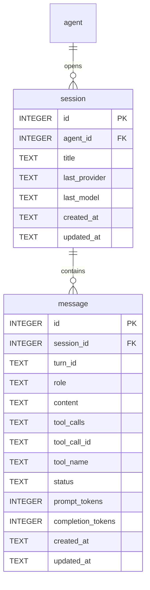
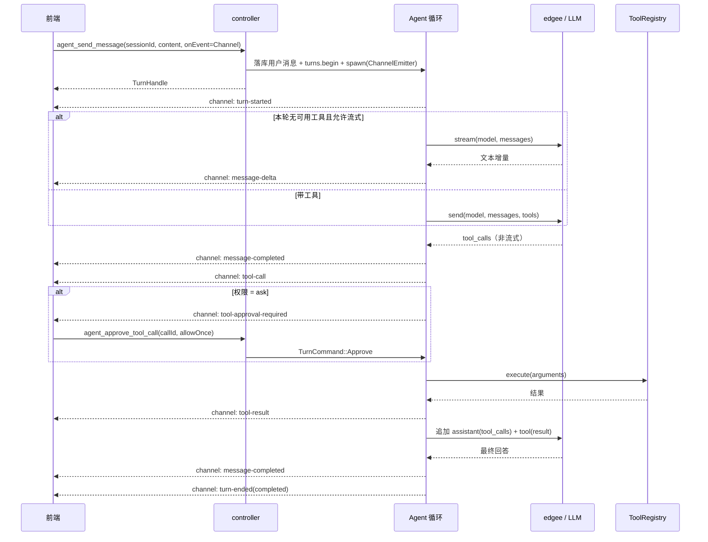

# Agent 模块设计（二）：会话存储、Agent 循环与 LLM 接入

本文承接 `docs/agent_module_design.md`，沿用其分层、命名与文档结构。上一阶段已落地
Agent / 工具元数据、工具三级权限与 bucket 文件系统适配；本阶段在此之上补齐 Agent 真正
「跑起来」所需的三块能力：

1. **Agent 会话存储**：会话与消息的持久化、标题与生命周期管理。
2. **Agent 循环基础**：装配上下文 → 调用大模型 → 执行工具 → 回填结果 → 循环至最终回答，
   包含流式输出、工具权限 `ask` 的暂停与恢复、取消与步数上限。
3. **大语言模型 API 接入**：以 **edgee**（Edgee AI Gateway 的 Rust SDK）作为统一接入层，
   通过 provider 配置切换网关或任意 OpenAI 兼容端点，支持工具调用与流式输出。

## 1. 设计目标

### 1.1 本阶段目标

1. **会话与消息落库**
   - `session`：属于某个 Agent，含标题、创建/更新时间，以及最近一轮模型调用使用的
     `last_provider` / `last_model`。
   - `message`：`system / user / assistant / tool` 四种角色，一条消息即可承载纯文本、
     助手发起的工具调用、以及工具返回结果；流式过程中标记 `streaming` 状态。
   - 会话 CRUD 与消息读取；启动时把遗留的 `streaming` 消息收敛为 `interrupted`。
2. **Agent 循环基础**
   - 会话初始化时把 Agent 的系统提示词固化为一条 `system` 快照消息，随后每轮循环
     基于「系统快照 + 历史消息 + 当前可用工具」构造请求。
   - 循环在有工具调用时执行工具、把结果写回消息表并再次请求模型；无工具调用或达到
     步数上限时结束本轮。整轮通过 Tauri Channel 推进度。
   - 权限为 `ask` 的工具调用暂停循环并请求用户确认；用户可「仅本次允许 / 始终允许 /
     拒绝」，`始终允许` 会回写 `agent_tool`；`拒绝` 作为一种工具结果回填给模型。
3. **LLM API 接入（edgee）**
   - 用 `edgee` 的 `send` / `stream` 作为唯一的模型调用出口，provider 配置
     （`base_url`、`api_key`、`model`）来自 `config.toml`，运行期可读写并回写文件；
     查询接口对密钥脱敏。
   - `base_url` 可指向 Edgee 网关（`https://edgee.io`）或任意 OpenAI 兼容端点，
     模型名按厂商约定书写（如 `anthropic/claude-haiku-4-5`）。
   - SDK 未提供的超时、重试与取消由我们在其外层用 tokio 补齐；`SendResponse` 自带的
     `usage` 与压缩指标一并落库或用于展示。
   - 每轮开始时解析实际调用的 provider / model，并把结果记入会话的 `last_provider` /
     `last_model`；后续轮次以会话记录为准，因此调整 `config.toml` 的默认 provider 或模型
     不会改变既有会话正在使用的模型。

### 1.2 本阶段不做

- **`asset.*` / `user.*` 工具实现**：Anki 的 10 个工具已在本阶段落地（实现于
  `service/tool/anki.rs`，参数与返回契约由 `migrations/000005.sql` 覆盖，启动时校验
  「已注册 ⊆ 工具目录」）；其余工具仍未实现，循环返回 `tool_unavailable` 的工具结果，
  保证循环可运行、可测试。
- **带工具请求的 token 级流式**：edgee 2.0.7 的流式工具调用分片无法可靠组装（见 5.1），
  因此带工具的一轮走非流式；流式只在「本轮没有可调用工具」时启用。
- **`temperature` / `max_tokens` 配置**：edgee 的请求体未暴露这两个参数，由网关与模型
  默认值决定。
- **资产索引注入与检索**：上下文构建保留扩展点，本阶段不注入学习资产索引。
- **长期记忆与上下文压缩**：历史消息全量进入请求，不做截断或摘要。
- **多模态与附件**：不支持图片、语音与文件上传给模型。
- **会话分支、消息编辑重发、重新生成**：均不在本阶段。
- **模型切换入口**：会话只记录最近使用的 provider / model，本阶段不提供切换模型的前端控件，
  切换通过设置页修改默认值、新开会话生效。
- **Token 配额与计费统计**：只记录每条助手消息的用量，不做聚合与限制。

### 1.3 总体分层

```
src-tauri/src/
├── interface/            # 跨层共享的 DTO、事件与错误
│   ├── session.rs        # 会话、消息、轮次 DTO
│   ├── llm.rs            # 对话请求/响应、工具 Schema、流式事件
│   └── event.rs          # Channel 推送的事件类型
├── repository/           # 数据访问
│   └── session.rs        # session / message 的 SQL
├── service/              # 业务编排
│   ├── llm/              # edgee 后端、provider 解析、超时/重试/取消
│   ├── loop/             # Agent 循环、上下文构建、轮次注册表
│   └── session.rs        # 会话 CRUD 与轮次入口
└── controller/           # Tauri 命令，仅做参数透传
```

依赖方向保持单向：`controller -> service -> repository -> db / fs`，
`service/llm` 只依赖 `config` 与 `interface`，`interface` 被各层引用。

---

## 2. 将实现的接口

### 2.1 通用约定

- DTO 使用 `serde`，序列化统一 `camelCase`；枚举使用 `snake_case`。
- 会话、消息、Agent 的 id 均为整数；轮次 id 为不透明字符串（形如 `t-1726300000000-3`）。
- 消息 `content` 统一为字符串：助手回答是 Markdown 文本，工具结果是一段 JSON 文本。
  工具调用的结构化信息放在 `tool_calls` / `tool_call_id` 字段，不混入 `content`。
- 时间戳统一 RFC3339（`chrono::Utc::now().to_rfc3339()`）。
- 后端到前端的进度统一走 Tauri `Channel`：启动轮次的命令接收一个 `Channel<AgentEvent>`
  参数，一轮一个 channel，见 2.7。
- `ApiError` 在既有构造器基础上新增三个：

```rust
// interface/error.rs（增量）
impl ApiError {
    pub fn llm_unconfigured(m: impl Into<String>) -> Self; // llm_unconfigured
    pub fn llm_error(m: impl Into<String>) -> Self;        // llm_error
    pub fn turn_conflict(m: impl Into<String>) -> Self;    // turn_conflict
}
```

### 2.2 会话与消息类型（interface/session.rs）

```rust
/// 消息角色；system 为会话创建时固化的系统提示词快照。
#[derive(Serialize, Deserialize, Clone, Copy, PartialEq, Eq, Debug)]
#[serde(rename_all = "snake_case")]
pub enum MessageRole { System, User, Assistant, Tool }

/// 消息状态：流式中 / 完成 / 出错 / 被中断。
#[derive(Serialize, Deserialize, Clone, Copy, PartialEq, Eq, Debug)]
#[serde(rename_all = "snake_case")]
pub enum MessageStatus { Streaming, Complete, Error, Interrupted }

/// 助手发起的一次工具调用。
pub struct ToolCall {
    pub id: String,                  // 模型侧调用 id，回填 tool 消息时使用
    pub tool_id: String,             // <group>.<id>
    pub arguments: serde_json::Value,
}

pub struct MessageInfo {
    pub id: i64,
    pub session_id: i64,
    pub turn_id: Option<String>,     // system 快照为 None
    pub role: MessageRole,
    pub content: String,
    pub tool_calls: Vec<ToolCall>,
    pub tool_call_id: Option<String>,
    pub tool_name: Option<String>,   // 工具消息对应的 <group>.<id>
    pub status: MessageStatus,
    pub prompt_tokens: Option<i64>,
    pub completion_tokens: Option<i64>,
    pub created_at: String,
}

pub struct SessionInfo {
    pub id: i64,
    pub agent_id: i64,
    pub title: String,
    pub last_provider: Option<String>,   // 最近一轮使用的 provider 名；未调用过为 None
    pub last_model: Option<String>,      // 最近一轮使用的模型名；未调用过为 None
    pub message_count: u32,
    pub last_message_at: Option<String>,
    pub created_at: String,
    pub updated_at: String,
}

/// 会话 + 全部消息；前端打开会话时一次性读取。
pub struct SessionDetail { pub session: SessionInfo, pub messages: Vec<MessageInfo> }

pub struct SendMessageInput { pub session_id: i64, pub content: String }
pub struct StartSessionInput { pub agent_id: i64, pub content: String }

/// 一次用户输入的受理结果；后续内容通过命令传入的 Channel 推送。
pub struct TurnHandle { pub session_id: i64, pub turn_id: String }

#[derive(Serialize, Deserialize, Clone, Copy, PartialEq, Eq, Debug)]
#[serde(rename_all = "snake_case")]
pub enum TurnStatus { Completed, Cancelled, Failed, StepLimit }

/// 工具权限为 ask 时的用户裁决。
#[derive(Serialize, Deserialize, Clone, Copy, PartialEq, Eq, Debug)]
#[serde(rename_all = "snake_case")]
pub enum ApprovalDecision { AllowOnce, AllowAlways, Deny }
```

### 2.3 LLM 类型（interface/llm.rs）

```rust
/// 发给模型的单条消息；与 edgee 的 `Message` 一一对应。
pub struct ChatMessage {
    pub role: MessageRole,                  // 只使用 System / User / Assistant / Tool
    pub content: String,
    pub tool_calls: Vec<ToolCall>,          // 仅 assistant 非空
    pub tool_call_id: Option<String>,       // 仅 tool 非空
}

/// 暴露给模型的工具定义。
pub struct ToolSchema {
    pub name: String,                       // 线名，见 5.1 的映射
    pub tool_id: String,                    // <group>.<id>
    pub description: String,
    pub parameters: serde_json::Value,      // JSON Schema，受 5.1 的子集约束
}

/// 一次调用的实际目标；由 `LlmClient::resolve` 依据会话记录与默认配置得出。
pub struct LlmTarget { pub provider: String, pub model: String }

/// 一次模型调用的内容部分；provider 与模型由 `LlmTarget` 决定。
pub struct ChatRequest {
    pub messages: Vec<ChatMessage>,
    pub tools: Vec<ToolSchema>,
}

pub struct TokenUsage { pub prompt_tokens: i64, pub completion_tokens: i64, pub total_tokens: i64 }

/// Edgee 网关返回的压缩指标；直连端点时为 None。
pub struct CompressionInfo { pub saved_tokens: i64, pub reduction: f64, pub time_ms: i64 }

pub struct ChatResponse {
    pub content: String,
    pub tool_calls: Vec<ToolCall>,
    pub finish_reason: Option<String>,
    pub usage: Option<TokenUsage>,
    pub compression: Option<CompressionInfo>,
}

/// 流式回调事件；带工具的请求不走流式，因此只有文本增量。
#[derive(Clone, Debug)]
pub enum StreamEvent { ContentDelta(String) }

/// 连通性探测结果。
pub struct ProbeResult { pub provider: String, pub model: String, pub latency_ms: u64, pub reply: String }

/// 面向前端的 provider 视图，密钥脱敏。
pub struct LlmProviderView {
    pub name: String,
    pub base_url: String,
    pub model: String,
    pub api_key_configured: bool,
    pub api_key_masked: String,
    pub compression_model: Option<String>,
}

pub struct LlmConfigView {
    pub default_provider: String,
    pub max_steps: u32,
    pub allow_streaming: bool,
    pub providers: Vec<LlmProviderView>,
}

/// 更新 / 新增 provider；api_key 为 None 表示保留原密钥。
pub struct LlmProviderInput {
    pub name: String,
    pub base_url: String,
    pub model: String,
    pub api_key: Option<String>,
    pub compression_model: Option<String>,
}
```

### 2.4 repository 接口（repository/session.rs）

```rust
// 会话
pub fn list_sessions(conn: &Connection, agent_id: Option<i64>) -> Result<Vec<SessionInfo>, ApiError>;
pub fn get_session(conn: &Connection, session_id: i64) -> Result<Option<SessionInfo>, ApiError>;
pub fn insert_session(conn: &Connection, agent_id: i64, title: &str) -> Result<SessionInfo, ApiError>;
pub fn update_title(conn: &Connection, session_id: i64, title: &str) -> Result<SessionInfo, ApiError>;
pub fn touch_session(conn: &Connection, session_id: i64) -> Result<(), ApiError>;
pub fn set_session_model(conn: &Connection, session_id: i64, provider: &str, model: &str)
    -> Result<(), ApiError>;                                           // 每轮开始时记录调用目标
pub fn delete_session(conn: &Connection, session_id: i64) -> Result<(), ApiError>;

// 消息
pub fn list_messages(conn: &Connection, session_id: i64) -> Result<Vec<MessageInfo>, ApiError>;
pub fn append_message(conn: &Connection, session_id: i64, new: &NewMessage) -> Result<MessageInfo, ApiError>;
pub fn begin_assistant_message(conn: &Connection, session_id: i64, turn_id: &str)
    -> Result<MessageInfo, ApiError>;                                  // status = streaming
pub fn append_content(conn: &Connection, message_id: i64, delta: &str) -> Result<i64, ApiError>;
pub fn finish_message(conn: &Connection, message_id: i64, patch: &MessagePatch)
    -> Result<MessageInfo, ApiError>;                                  // 状态、完整内容、工具调用、用量
pub fn interrupt_streaming(conn: &Connection, session_id: i64) -> Result<u32, ApiError>;
```

`NewMessage` / `MessagePatch` 为 repository 内部输入结构，避免为每个字段单开参数。

### 2.5 service 接口

```rust
// service/tool/mod.rs —— 在既有扩展点上补齐执行契约（同步，事务内调用）
pub struct ToolContext<'a> {
    pub conn: &'a Connection,
    pub agent_id: i64,
    pub session_id: i64,
    pub config: &'a ConfigHandle,
}

pub struct ToolOutcome { pub content: serde_json::Value }

pub trait Tool: Send + Sync {
    fn key(&self) -> ToolKey;
    /// 执行工具；返回 `Ok` 时结果回填给模型，返回 `Err` 时错误以工具结果形式回填。
    fn execute(&self, ctx: &ToolContext<'_>, arguments: serde_json::Value)
        -> Result<ToolOutcome, ApiError>;
}

impl ToolRegistry {
    pub fn execute(&self, key: &ToolKey, ctx: &ToolContext<'_>, arguments: serde_json::Value)
        -> Result<ToolOutcome, ApiError>;                 // 未注册 -> tool_unavailable
}

// service/event.rs —— 推送抽象，便于脱离 Tauri 测试
pub trait EventEmitter: Send + Sync {
    fn emit(&self, event: AgentEvent);
}

/// 基于 Tauri Channel 的实现；`Channel` 内部是 `Arc`，克隆后指向同一通道。
#[derive(Clone)]
pub struct ChannelEmitter { channel: Channel<AgentEvent> }

impl ChannelEmitter {
    pub fn new(channel: Channel<AgentEvent>) -> Self;
}

impl EventEmitter for ChannelEmitter {
    fn emit(&self, event: AgentEvent) {
        if let Err(e) = self.channel.send(event) { /* 仅记日志，不中断循环 */ }
    }
}

// service/llm/mod.rs —— edgee 后端抽象
pub type BoxFut<'a, T> = Pin<Box<dyn Future<Output = T> + Send + 'a>>;

pub trait LlmBackend: Send + Sync {
    /// 非流式调用，对应 edgee 的 `send`；工具调用与用量都在这里获得。
    fn complete<'a>(&'a self, cfg: &'a ProviderConfig, model: &'a str, request: &'a ChatRequest)
        -> BoxFut<'a, Result<ChatResponse, ApiError>>;
    /// 流式调用，对应 edgee 的 `stream`；只用于无工具的请求。
    fn stream<'a>(&'a self, cfg: &'a ProviderConfig, model: &'a str, request: &'a ChatRequest,
                  sink: &'a mut (dyn FnMut(StreamEvent) + Send))
        -> BoxFut<'a, Result<ChatResponse, ApiError>>;
}

#[derive(Clone)]
pub struct LlmClient { /* ConfigHandle, Arc<dyn LlmBackend>, Arc<RwLock<HashMap<String, Edgee>>> */ }

impl LlmClient {
    pub fn new(config: ConfigHandle, backend: Arc<dyn LlmBackend>) -> Self;
    /// 解析一次调用的目标：provider 取会话记录的 `last_provider`，缺省用 `default_provider`；
    /// 模型取会话记录的 `last_model`，缺省用该 provider 配置的 `model`。
    /// provider 名不存在、模型或密钥缺失时返回 `llm_unconfigured`。
    pub fn resolve(&self, last_provider: Option<&str>, last_model: Option<&str>)
        -> Result<LlmTarget, ApiError>;
    pub async fn complete(&self, target: &LlmTarget, request: &ChatRequest)
        -> Result<ChatResponse, ApiError>;
    pub async fn stream(&self, target: &LlmTarget, request: &ChatRequest,
                        sink: &mut (dyn FnMut(StreamEvent) + Send))
        -> Result<ChatResponse, ApiError>;
    pub async fn probe(&self, name: Option<&str>) -> Result<ProbeResult, ApiError>;
}

// service/loop/mod.rs —— 轮次注册表与循环
pub struct TurnRegistry { /* std::sync::Mutex<HashMap<i64, TurnControl>> */ }

impl TurnRegistry {
    pub fn new() -> Self;
    pub fn begin(&self, session_id: i64, turn_id: &str)
        -> Result<TurnControlHandle, ApiError>;           // 已有进行中轮次 -> turn_conflict
    pub fn finish(&self, session_id: i64, turn_id: &str);
    pub fn cancel(&self, session_id: i64) -> Result<(), ApiError>;             // 同步命令可调用
    pub fn approve(&self, session_id: i64, turn_id: &str, call_id: &str,
                   decision: ApprovalDecision) -> Result<(), ApiError>;        // 同步命令可调用
}

// service/session.rs
#[derive(Clone)]
pub struct SessionService { /* db, tools, llm, turns, config */ }

impl SessionService {
    pub fn new(db: Arc<Mutex<Connection>>, tools: Arc<ToolRegistry>, llm: LlmClient,
               config: ConfigHandle) -> Self;

    pub fn list_sessions(&self, agent_id: Option<i64>) -> Result<Vec<SessionInfo>, ApiError>;
    pub fn get_session(&self, session_id: i64) -> Result<SessionDetail, ApiError>;
    pub fn rename_session(&self, session_id: i64, title: &str) -> Result<SessionInfo, ApiError>;
    pub fn delete_session(&self, session_id: i64) -> Result<(), ApiError>;

    /// 新建会话并立即开始第一轮；事件经传入的 emitter（由 controller 从 Channel 构造）推送。
    pub fn start_session(&self, input: StartSessionInput, emitter: Arc<dyn EventEmitter>)
        -> Result<TurnHandle, ApiError>;
    /// 在既有会话上开始新一轮。
    pub fn send_message(&self, input: SendMessageInput, emitter: Arc<dyn EventEmitter>)
        -> Result<TurnHandle, ApiError>;
    pub fn cancel_turn(&self, session_id: i64) -> Result<(), ApiError>;
    pub fn approve_tool_call(&self, session_id: i64, turn_id: &str, call_id: &str,
                             decision: ApprovalDecision) -> Result<(), ApiError>;
}

// config/llm.rs
pub struct LlmConfig {
    pub default_provider: Option<String>,                 // 未配置时为 None
    pub max_steps: u32,                                   // 单轮循环步数上限，默认 8
    pub request_timeout_seconds: u64,                     // 默认 120
    pub max_retries: u32,                                 // 默认 2
    pub allow_streaming: bool,                            // 默认 true
    pub providers: HashMap<String, ProviderConfig>,       // 默认空表，可在设置页新增
}

pub struct ProviderConfig {
    pub base_url: String,                                 // 不含 /v1，如 https://edgee.io
    pub api_key: String,
    pub model: String,                                    // 该 provider 的默认模型
    pub compression_model: Option<String>,                // 仅 Edgee 网关有意义
}

impl ConfigHandle {
    pub fn llm(&self) -> LlmConfig;
    pub fn set_llm(&self, llm: LlmConfig) -> Result<(), ApiError>;   // 更新内存并回写 config.toml
}
```

### 2.6 Tauri 命令清单

会话与轮次（controller/session.rs）：

| 命令                     | 参数                                       | 返回              | 说明                                     |
| ------------------------ | ------------------------------------------ | ----------------- | ---------------------------------------- |
| `session_list`           | `agentId?`                                 | `SessionInfo[]`   | 按更新时间倒序；缺省为全部 Agent          |
| `session_get`            | `sessionId`                                | `SessionDetail`   | 会话 + 全部消息（含 `interrupted` 收敛）  |
| `session_rename`         | `sessionId, title`                         | `SessionInfo`     | 重命名                                   |
| `session_delete`         | `sessionId`                                | `()`              | 级联删除消息                             |
| `agent_start_session`    | `input: StartSessionInput, onEvent: Channel<AgentEvent>` | `TurnHandle` | 建会话并开始第一轮            |
| `agent_send_message`     | `input: SendMessageInput, onEvent: Channel<AgentEvent>`  | `TurnHandle` | 开始新一轮                    |
| `agent_cancel_turn`      | `sessionId`                                | `()`              | 取消进行中的轮次                         |
| `agent_approve_tool_call`| `sessionId, turnId, callId, decision`      | `()`              | 裁决 `ask` 工具调用                      |

只有启动轮次的两个命令接收 channel：controller 用 `ChannelEmitter::new(onEvent)` 包一层，
再把 `Arc<dyn EventEmitter>` 交给 `SessionService`。取消与裁决是**输入型**命令，返回值即
受理结果，其后的进展（`turn-ended`、工具结果）继续沿该轮原有的 channel 送达，因此无需
再传 channel。

模型配置（controller/llm.rs）：

| 命令                       | 参数                        | 返回              | 说明                       |
| -------------------------- | --------------------------- | ----------------- | -------------------------- |
| `llm_get_config`           | —                           | `LlmConfigView`   | 密钥脱敏                   |
| `llm_upsert_provider`      | `input: LlmProviderInput`   | `LlmConfigView`   | 新增或更新 provider        |
| `llm_set_default_provider` | `name`                      | `LlmConfigView`   | 切换默认 provider          |
| `llm_test_provider`        | `name?`                     | `ProbeResult`     | 连通性探测                 |

会话级模型记录：`session` 表新增可空的 `last_provider` / `last_model`（见 3.3），
`SessionInfo` 增加同名可选字段；`agent` 表与 `AgentInfo` 保持不变。取值顺序为
「会话记录 → 默认 provider / 模型」，并在每轮开始时写回会话。

### 2.7 Channel 消息清单

一轮对话对应一个 `Channel<AgentEvent>`，由启动该轮的命令传入（见 2.6）。`AgentEvent` 是
内部标签枚举，`type` 即下表标签，前端按 `event.type` 分发；没有全局事件名，也不做广播。

| `type`                      | 载荷                                                                   | 触发时机             |
| --------------------------- | ---------------------------------------------------------------------- | -------------------- |
| `turn-started`              | `{ sessionId, turnId }`                                                | 轮次开始             |
| `message-delta`             | `{ sessionId, turnId, messageId, delta }`                              | 助手文本增量（仅无工具请求） |
| `message-completed`         | `{ sessionId, turnId, message: MessageInfo }`                          | 一条消息定稿         |
| `tool-call`                 | `{ sessionId, turnId, call: ToolCall }`                                | 模型发起工具调用     |
| `tool-approval-required`    | `{ sessionId, turnId, callId, toolId, arguments }`                     | 权限为 `ask`，等待裁决 |
| `tool-result`               | `{ sessionId, turnId, callId, toolId, ok, result?, error? }`            | 工具执行结束         |
| `turn-ended`                | `{ sessionId, turnId, status, error? }`                                | 轮次结束             |

```rust
// interface/event.rs —— 即 Channel<AgentEvent> 的载荷
#[derive(Serialize, Clone, Debug)]
#[serde(tag = "type", rename_all = "kebab-case")]
pub enum AgentEvent {
    TurnStarted { session_id: i64, turn_id: String },
    MessageDelta { session_id: i64, turn_id: String, message_id: i64, delta: String },
    MessageCompleted { session_id: i64, turn_id: String, message: MessageInfo },
    ToolCall { session_id: i64, turn_id: String, call: ToolCall },
    ToolApprovalRequired { session_id: i64, turn_id: String, call_id: String,
                           tool_id: String, arguments: serde_json::Value },
    ToolResult { session_id: i64, turn_id: String, call_id: String, tool_id: String,
                 ok: bool, result: Option<serde_json::Value>, error: Option<ApiError> },
    TurnEnded { session_id: i64, turn_id: String, status: TurnStatus, error: Option<ApiError> },
}
```

`AgentEvent` 只需 `Serialize + Clone + Send + Sync`，不需要 `Deserialize`：channel 参数在
命令侧只是一个由 Tauri 解析的字符串载荷。

### 2.8 前端契约调整

1. `src/types/chat.ts` 拆分为会话类型与 Agent 类型：
   - `ChatSession` → `SessionInfo`（`id: number`、`agentId: number`、`title`、
     `messageCount`、`lastMessageAt`、`lastProvider?: string`、`lastModel?: string`、时间戳）。
   - `ChatMessage` → `MessageInfo`（`id: number`、`role` 扩展 `system | tool` 与 `user | assistant`、
     `content: string`、`toolCalls`、`status`）；`ContentBlock` 与 `ContentType` 保留为
     **纯前端视图模型**，由 `content` 文本渲染出 `text` / `latex`，由工具消息渲染出 `result`。
2. `src/services/api.ts` 更名为 `src/services/session.ts`，命令改为 `session_*`、
   `agent_start_session`、`agent_send_message`、`agent_cancel_turn`、`agent_approve_tool_call`；
   新增 `src/services/llm.ts` 封装 `llm_*`。
3. `useChatSessions.ts` 改为 Channel 驱动：为每轮 `new Channel<AgentEvent>()` 并设置
   `onmessage`，把它作为 `onEvent` 传给 `agent_start_session` / `agent_send_message`；
   `turn-started` 进入等待态、`message-delta` 增量渲染、`tool-call` 与
   `tool-approval-required` 驱动工具气泡与确认弹窗、`turn-ended` 结束后刷新会话列表。
   Channel 实例按 sessionId 存入 Map 并持有到轮次结束——Rust 侧的 Channel 被 drop 时
   Tauri 会向前端发送结束标记并自动回收回调，因此不需要手动 `unlisten`。
4. **流式呈现是条件性的**：带工具的一轮没有 `message-delta`，前端需要区分两种等待态——
   已收到增量时显示流式光标，未收到增量时用「AI 正在整理答案...」加工具调用消息展示进度，
   收到 `message-completed` 后用完整内容覆盖本地状态。
5. Mock 层降级：`src/mocks/chat.ts` 的 `chat_*` 命令随真实命令替换为 `session_*` 与
   `agent_*`；`new Channel` 在 `mockIPC` 下可用（它已提供 `transformCallback`）。本阶段
   Mock 不产生 channel 消息，`agent_start_session` / `agent_send_message` 直接返回完整
   消息，前端按非流式路径渲染；后续若要模拟流式，可在 handler 中解析 `onEvent` 的
   `__CHANNEL__:<id>` 并用 `window.__TAURI_INTERNALS__.runCallback(id, { index, message })`
   按序回放 `turn-started` / `message-delta` / `turn-ended`。
6. `AgentSession.vue` 增加：流式光标、工具调用卡片、以及 `ask` 的确认弹窗
   （「仅本次允许 / 始终允许 / 拒绝」）与取消按钮；并在标题栏只读展示 `lastModel`
   （为 `null` 时显示「默认模型」），让用户知道本会话正在使用哪个模型。

---

## 3. 数据表架构

### 3.1 迁移策略

延续编号驱动的增量重放机制（见 `docs/database_migration.md`），本阶段新增
`src-tauri/migrations/000003.sql`，负责：

- 建立 `session` 与 `message` 两张表；`session` 含记录最近调用的
  `last_provider` / `last_model`。
- 不新增、不修改 `agent` 表：Agent 实例（内置 `id = 1 / 2` 与用户自建）沿用
  `000002.sql` 已有的 `agent` 表及其 `AgentInfo` / `AgentConfigInput` 接口。

`000002.sql` 已提交，保持不变；会话相关的后续调整一律新增更高编号的迁移文件。

### 3.2 ER 概览



`agent` 是 `000002.sql` 已建立的 Agent 实例表（`name`、`description`、`icon`、`color`、
`system_prompt`、`builtin` 等），本阶段只读取其中的 `system_prompt` 作为会话快照，不新增列、
不改结构；`000003.sql` 的新增内容只有 `session` 与 `message` 两张表。

`message.role` 为 `system / user / assistant / tool`；`tool_calls` 是以 JSON 文本存储的
工具调用数组；工具结果消息用 `tool_call_id` 与 `tool_name` 关联到发起它的助手消息。

### 3.3 迁移 000003.sql

```sql
-- Agent 会话存储：session、message 两张表。
-- 本文件只在 user_version 从 2 推进到 3 时执行一次，无需幂等。

-- 会话：一个会话属于一个 Agent；消息随会话级联删除。
-- last_provider / last_model 记录最近一轮实际调用的模型，未调用过为 NULL。
CREATE TABLE session (
    id            INTEGER PRIMARY KEY AUTOINCREMENT,
    agent_id      INTEGER NOT NULL,
    title         TEXT    NOT NULL,
    last_provider TEXT,
    last_model    TEXT,
    created_at    TEXT    NOT NULL,
    updated_at    TEXT    NOT NULL,
    FOREIGN KEY (agent_id) REFERENCES agent (id) ON DELETE CASCADE
);

CREATE INDEX idx_session_agent ON session (agent_id, updated_at DESC);

-- 消息：系统提示词快照、用户输入、助手回答与工具调用、工具结果。
CREATE TABLE message (
    id                INTEGER PRIMARY KEY AUTOINCREMENT,
    session_id        INTEGER NOT NULL,
    turn_id           TEXT,                              -- 同一轮的 user/assistant/tool 共用
    role              TEXT    NOT NULL
                      CHECK (role IN ('system', 'user', 'assistant', 'tool')),
    content           TEXT    NOT NULL DEFAULT '',
    tool_calls        TEXT,                              -- JSON 数组，仅 assistant 使用
    tool_call_id      TEXT,                              -- 仅 tool 使用
    tool_name         TEXT,                              -- 仅 tool 使用，<group>.<id>
    status            TEXT    NOT NULL DEFAULT 'complete'
                      CHECK (status IN ('streaming', 'complete', 'error', 'interrupted')),
    prompt_tokens     INTEGER,
    completion_tokens INTEGER,
    created_at        TEXT    NOT NULL,
    updated_at        TEXT    NOT NULL,
    FOREIGN KEY (session_id) REFERENCES session (id) ON DELETE CASCADE
);

CREATE INDEX idx_message_session ON message (session_id, id);
```

### 3.4 其它约定

- 会话标题在首条用户消息写入时自动截取（超过 20 字符加省略号），用户可随后重命名；
  `rename_session` 之后不再被自动标题覆盖。
- `system` 快照消息的 `turn_id` 为 `NULL`，`created_at` 即会话创建时间；它不参与前端消息列表。
- 不设独立 `turn` 表：轮次状态通过 `turn_id`、消息 `status` 与事件表达；
  进程退出后遗留的 `streaming` 消息在下次读取会话时收敛为 `interrupted`。
- `deny` 的工具调用不落库为独立记录，而是以「错误工具结果」的形式回填给模型，
  保持消息序列对模型与前端都完整可读。
- `session.last_provider` / `last_model` 在每轮解析出调用目标后、随用户消息一起写入
  （与 `touch_session` 同一事务）；首轮之前为 `NULL`，读取时归一化为 `None`，
  语义是「尚未调用过模型，跟随默认配置」。

---

## 4. 文件职责

| 文件                         | 职责                                                                     | 依赖                                                        |
| ---------------------------- | ------------------------------------------------------------------------ | ----------------------------------------------------------- |
| `interface/error.rs`         | 共享 `ApiError`；新增 `llm_unconfigured` / `llm_error` / `turn_conflict` | —                                                           |
| `interface/session.rs`       | 会话、消息、轮次、裁决 DTO                                               | error                                                       |
| `interface/llm.rs`           | 对话请求/响应、工具 Schema、流式事件、provider 视图                      | session, error                                              |
| `interface/event.rs`         | `AgentEvent`（Channel 载荷，内部标签枚举）                                | session, error                                              |
| `interface/agent.rs`         | 既有 Agent / 工具 DTO（本阶段不修改）                                    | error                                                       |
| `config/mod.rs`              | `AppConfig` 增加 `llm`；`ConfigHandle::llm` / `set_llm` 与配置文件回写   | llm, toml                                                   |
| `config/llm.rs`              | `LlmConfig` / `ProviderConfig` 与默认值                                  | —                                                           |
| `repository/session.rs`      | `session` / `message` 的 SQL 读写与状态收敛，含 `set_session_model`      | interface, db                                               |
| `repository/agent.rs`        | 既有实现（本阶段不修改）                                                 | interface, db                                               |
| `service/tool/mod.rs`        | `ToolKey`、`Tool::execute`、`ToolRegistry`、`validate_registry`            | interface, config, repository                               |
| `service/tool/anki.rs`       | 10 个 `anki.*` 工具实现与注册入口                                        | service/anki, repository, interface                         |
| `service/tool/args.rs`       | 工具参数解析助手（缺省/类型收敛与 `invalid_input`）                      | interface                                                    |
| `service/llm/mod.rs`         | `LlmBackend` 抽象、`LlmClient`、provider 解析、超时/重试/流式包装         | config, interface, edgee                                    |
| `service/llm/edgee.rs`       | `EdgeeBackend`：DTO → `edgee::Message` / `Tool` 映射、线名映射、错误转换   | interface, edgee, tokio                                     |
| `service/event.rs`           | `EventEmitter` 抽象与 `ChannelEmitter`（唯一接触 Tauri 类型的服务层文件） | interface, tauri                                            |
| `service/loop/mod.rs`        | Agent 循环：上下文构建、工具执行、权限暂停、步数与取消                    | repository, service::llm, service::tool, service::permission |
| `service/loop/context.rs`    | 系统快照 + 历史消息 + 可用工具 → `ChatRequest`                            | repository, interface                                       |
| `service/loop/turn.rs`       | `TurnRegistry` 与 `TurnControlHandle`（tokio watch / mpsc）               | interface, tokio                                            |
| `service/session.rs`         | 会话 CRUD、轮次启动与异步任务编排                                          | repository::session, service::loop, service::llm             |
| `controller/session.rs`      | 会话与轮次命令；把 `Channel<AgentEvent>` 包装为 `ChannelEmitter`          | service::session, interface                                 |
| `controller/llm.rs`          | provider 配置与探测命令                                                   | config, service::llm                                        |
| `controller/mod.rs`          | 汇总 `controller_handlers!`                                               | 各 controller                                               |
| `lib.rs`                     | `AppState` 新增 `session` / `llm`；装配 `EdgeeBackend`                    | 各 service                                                  |

`service/session.rs` 与 `service/loop/` 不接触 Tauri 类型：事件经 `EventEmitter` 抽象发出、
模型调用经 `LlmBackend` 抽象进入，因此循环逻辑可以在单元测试中以
「记录型 emitter + 桩 backend + 桩工具」完整跑通。Tauri `Channel` 只出现在
`service/event.rs` 的 `ChannelEmitter` 与 `controller/session.rs` 的命令签名中。

---

## 5. 具体实现思路

### 5.1 edgee SDK 事实与接入约束

`edgee` 2.0.7 是 Edgee AI Gateway 的官方 Rust SDK，本质是一个 tokio + `reqwest` 的
异步 OpenAI 兼容客户端：`EdgeeConfig { api_key, base_url }` 决定端点
`{base_url}/v1/chat/completions`，`model` 在每次调用时传入。它同时适用于 Edgee 网关
（默认 `https://edgee.io`）与任何 OpenAI 兼容端点（把 `base_url` 指向该厂商根地址即可）。

| SDK 事实                                                                 | 对设计的影响                                       | 我们的应对                                              |
| ------------------------------------------------------------------------ | -------------------------------------------------- | ------------------------------------------------------- |
| `send` / `stream` 均为 `async`，内部持有 `reqwest::Client`               | 循环必须运行在 tokio 运行时上                      | 循环用 `tauri::async_runtime::spawn` 启动                |
| 端点为 `{base_url}/v1/chat/completions`，默认 `https://edgee.io`          | `base_url` **不含** `/v1`                          | 配置里写厂商根地址，文档中明确                           |
| `from_env()` 读取 `EDGEE_API_KEY` / `EDGEE_BASE_URL`                       | 支持零配置启动                                     | 配置缺密钥时回退环境变量                                 |
| 请求体只含 `model / messages / tools / tool_choice / tags / compression_model` | 无法传 `temperature`、`max_tokens`           | 不提供这两项配置，采用网关与模型默认值                   |
| `JsonSchema` 仅含 `type / properties / required / description`             | 复杂 JSON Schema 关键字会丢失                      | 工具参数 Schema 约束为「顶层 object + properties/required」 |
| `StreamChunk` 不含 `usage`，`StreamChunk` 无压缩字段                       | 流式拿不到用量与压缩指标                           | 默认非流式；需要用量时走 `send`                          |
| `StreamDelta.tool_calls` 反序列化要求 `id / type / function.name / arguments` 全部存在 | OpenAI 风格的分片式工具调用增量会被解析失败并丢弃 | **带工具的请求不使用 `stream()`**                        |
| SDK 未暴露超时、重试、取消                                                 | 长请求可能悬挂、无法中断                           | 外层用 `tokio::time::timeout`、手动重试、`select!` 取消   |
| `Message` 无 `name` 字段；`ToolCall.function.arguments` 是字符串           | 工具名与参数需要转换                               | 我们存 `Value`，由 `EdgeeBackend` 序列化/解析            |
| OpenAI 限制 function name 不含 `.`                                        | `<group>.<id>` 不能直接作为工具名                  | 线名映射 `<group>__<id>`，见下                           |
| `SendResponse.compression` 提供节省 token / 成本 / 耗时                    | 可观测成本收益                                     | 可选压缩开关，指标随 `ChatResponse` 返回                 |

**线名映射**：请求期把 `ToolKey` 渲染成 `<group>__<id>`，并在该次请求内维护
`wire_name -> ToolKey` 映射；响应中的 `function.name` 经映射还原为 `<group>.<id>`。
映射以本次请求构建的表为准，因此工具组或 id 中含 `__` 也不会歧义。

**Schema 子集**：`context.rs` 在把 `tool.parameters`（`serde_json::Value`）交给后端前做一次
规范化——提取 `type`（缺省补 `object`）、`properties`、`required`、`description`，
其余关键字忽略并记一条 warning。当前迁移播种的工具参数都是 `{}`，天然满足约束；
后续新增工具时以此子集编写 Schema。

**流式策略**：`allow_streaming` 为真且本轮 `tools` 为空时走 `stream()`，其余一律走
`complete()`。这带来一个确定的用户体验：配备工具（权限非全 `deny`）的 Agent 不产生
`message-delta`，改用 `turn-started` + 工具事件表达进度；纯对话 Agent 则享受逐字输出。

### 5.2 LLM 客户端与错误处理

```rust
// service/llm/edgee.rs（要点）
impl LlmBackend for EdgeeBackend {
    fn complete<'a>(&'a self, cfg: &'a ProviderConfig, model: &'a str, request: &'a ChatRequest)
        -> BoxFut<'a, Result<ChatResponse, ApiError>>
    {
        Box::pin(async move {
            let client = self.client_for(cfg);                 // 见下：缓存复用
            let model = model.to_owned();
            let input = build_input(request);                  // messages + tools
            let response = client.send(model, input).await.map_err(map_edgee_error)?;
            Ok(convert(response))
        })
    }
    // stream 同理，逐块读取 StreamChunk 并把文本经 sink 回调
}
```

- **客户端复用**：`LlmClient` 按 provider 名缓存 `Edgee`，缓存键附带
  `(base_url, api_key)` 指纹；`set_llm` 变更配置后指纹不匹配即重建，
  避免每次调用都新建连接池。
- **超时**：`tokio::time::timeout(request_timeout_seconds, ...)` 包裹整次调用；
  超时映射为 `llm_error`（消息注明耗时）。SDK 自身没有超时配置，这一层是必需的。
- **重试**：对 `Http` 错误、以及 `Api { status }` 中 `408 / 429 / 5xx` 重试
  `max_retries` 次（默认 2），退避 500ms、1500ms；流式只在首个增量到达前重试，
  已产生输出则不再重试。
- **错误转换**：

  | edgee `Error`                      | `ApiError`          |
  | ---------------------------------- | ------------------- |
  | `MissingApiKey` / `InvalidConfig`  | `llm_unconfigured`  |
  | `Api { status, message }`          | `llm_error`         |
  | `Http`                             | `llm_error`         |
  | `Json`                             | `llm_error`         |
  | `Stream`                           | `llm_error`         |

- **协议转换细节**：`Role` 用 `System / User / Assistant / Tool`；assistant 带工具调用时需
  直接构造 `edgee::Message { role, content: None, tool_calls: Some(..), tool_call_id: None }`
  （SDK 的 `Message::assistant` 构造函数不支持 tool_calls）；tool 消息用
  `Message::tool(call_id, json_text)`；`ToolCall.call_type` 固定 `"function"`，
  `arguments` 由 `serde_json::Value` 序列化为字符串。
- **压缩开关**：provider 配置 `compression_model` 有值时调用
  `InputObject::with_compression_model`，只影响用户消息；指标在 `ChatResponse.compression`
  中返回，本阶段先随消息展示，聚合统计留待后续。

### 5.3 会话与消息存储

- 创建会话：`insert_session` 写入标题占位（首条用户消息到达前的 `title = '新会话'`），
  同时把 `agent.system_prompt` 固化为 `role = system` 的消息；系统提示词为空时写入
  一行默认说明。系统提示词之后的变化不影响既有会话。
- 会话标题：`agent_start_session` / `agent_send_message` 在写入首条用户消息时，
  若当前标题仍为占位值，则用该消息前 20 字符（超出加 `...`）更新标题并 `touch_session`。
- 调用目标：每轮在落库用户消息的同一事务里，用 `llm.resolve(session.last_provider,
  session.last_model)` 解析出 `LlmTarget`，再 `set_session_model` 写回会话；解析失败
  （provider 名不存在、模型或密钥缺失）时事务回滚，命令返回 `llm_unconfigured`，
  不产生任何消息。首轮写入后，后续轮次固定沿用同一 provider / model。
- 助手流式消息：仅流式路径会先 `begin_assistant_message` 插入 `status = streaming` 的空消息，
  内容增量按批累积，每 200ms 或每累积 512 字符调用一次 `append_content`，结束时
  `finish_message` 写入完整内容与状态。非流式路径直接以 `complete` 落库，不经过中间态。
- 冷启动恢复：`list_messages` / `get_session` 读取前先执行 `interrupt_streaming`，
  把残留的 `streaming` 消息标记为 `interrupted`，前端据此展示「本轮已中断」。
- 工具消息：`append_message` 写入 `role = tool`、`tool_call_id`、`tool_name`，
  `content` 为结果 JSON 文本；错误结果统一形如
  `{"ok": false, "error": { "code": "...", "message": "..." }}`。
- 会话列表用一条聚合查询同时取回 `message_count` 与 `last_message_at`，
  避免逐会话二次查询；排序为 `updated_at DESC, id DESC`。

### 5.4 上下文构建

`service/loop/context.rs` 负责把持久化状态翻译成模型请求：

1. **系统消息**：取该会话的 `role = system` 快照，作为 `messages[0]`。
2. **历史消息**：按 `id` 升序读取全部消息，跳过其它 `system` 记录；映射规则：
   - `user` → `{ role: User, content }`
   - `assistant` → `{ role: Assistant, content, tool_calls }`（有工具调用时 `content` 可为空）
   - `tool` → `{ role: Tool, tool_call_id, content }`（`tool_name` 仅用于我们自己的展示）
   - `streaming` / `interrupted` 的助手消息按已落库内容参与，保证上下文连续。
3. **工具集合**：读取 `tool` 表，过滤掉该 Agent 权限为 `deny` 的项，按 `(group, id)` 升序
   生成 `ToolSchema`（线名 + 规范化后的 Schema）。
4. **调用目标**：`LlmTarget` 由 `LlmClient::resolve` 依据会话的 `last_provider` /
   `last_model` 与默认配置得出（见 5.3），上下文构建只负责 `messages` 与 `tools`。

历史消息全量进入请求是本阶段的明确取舍；上下文截断、摘要与资产索引注入在后续阶段
以「上下文装配器」插件的形式接入，调用方无需改动。

### 5.5 Agent 循环与状态机

采用「一次性受理 + Channel 推进」模型：命令在极少的工作量后立即返回 `TurnHandle`，
真正的循环在 tokio 任务中执行，进度通过命令传入的 `Channel<AgentEvent>` 送达前端。



循环伪代码（异步）：

```
async fn run_turn(turn, mut ctl, emitter):          // emitter: Arc<dyn EventEmitter>
    emit TurnStarted
    let target = resolve_target(session_id)?              // 会话记录优先，并写回 session
    for step in 0..max_steps:
        if ctl.cancelled(): return finish(Cancelled)
        let request = build_context(session_id)?           // 同步、短锁
        let response = if request.tools.is_empty() && allow_streaming {
            select! {
                r = llm.stream(&target, &request, sink = emit delta) => r,
                _ = ctl.cancel.changed() => return finish(Cancelled),
            }
        } else {
            select! {
                r = llm.complete(&target, &request) => r,
                _ = ctl.cancel.changed() => return finish(Cancelled),
            }
        }?
        let assistant = persist_assistant(response)         // 含 tool_calls 与 usage
        emit MessageCompleted(assistant)
        if response.tool_calls.is_empty(): return finish(Completed)

        for call in response.tool_calls:
            if ctl.cancelled(): return finish(Cancelled)
            emit ToolCall(call)
            let outcome = dispatch(session_id, agent_id, call, &mut ctl).await
            let tool_msg = persist_tool_result(call, outcome)
            emit ToolResult(...)
    // 步数耗尽
    persist_assistant("已达到本轮工具调用上限，请继续追问。")
    return finish(StepLimit)
```

- `max_steps` 默认 8；达到上限时写入一条说明性助手消息，避免前端停在「AI 正在整理答案」。
- 每步的助手消息都独立落库，因此工具调用链路在会话历史中完整可见、可回放。
- 模型侧异常（网络、超时、解析失败）统一以 `TurnEnded(Failed)` 收尾，并保留已产出的
  助手内容（`status = error`），前端展示错误提示而不丢失上下文。

### 5.6 工具调用与权限交互

- **权限判定**复用上一阶段的 `service/permission::resolve`：
  - `deny`（含未配置）：不执行，直接把 `tool_denied` 错误结果作为工具消息回填，
    让模型向用户说明并给出替代方案。
  - `allow`：直接执行。
  - `ask`：`emit ToolApprovalRequired`，循环等待 `TurnControlHandle` 的 tokio 命令通道
    （输入方向，与推送事件用的 Tauri Channel 互不相干）。
- **裁决通道**：`TurnRegistry` 为每个进行中的会话持有
  `tokio::sync::mpsc::UnboundedSender<TurnCommand>`。`agent_approve_tool_call` 是同步命令，
  直接 `send` 即可（tokio 的 sender 可在任意线程调用）；循环侧用
  `tokio::select!` 同时等待 `commands.recv()` 与取消信号。
- **裁决语义**：
  - `AllowOnce`：仅本次执行，不改数据库。
  - `AllowAlways`：先把该 Agent 对该工具的权限改写为 `allow`（`set_tool_permission`），
    再执行；之后同类调用不再询问。
  - `Deny`：不执行，回填 `tool_denied` 工具结果，循环继续。
- **未实现的工具**：`tool` 表存在但 `ToolRegistry` 中无实现时，返回
  `tool_unavailable` 的工具结果；本阶段所有 `anki.*` / `asset.*` / `user.*` 都属于这种情况。
  `user.ask_question` 的实现可复用同一暂停机制（发出事件并等待用户文本输入），
  属可选扩展，本阶段先按 `tool_unavailable` 返回。
- **参数校验**：模型给出的 `arguments` 必须是 JSON 对象；非对象或 Schema 校验失败时，
  以 `invalid_input` 的错误结果回填，而不是中断整轮。
- `Tool::execute` 保持同步：现有与预期的工具（数据库、文件系统）都是同步操作，循环在
  一个不含 `await` 的作用域内完成「取锁 → 执行 → 释放」。将来若出现需要网络访问的
  异步工具，再把契约升级为 boxed future 并在工具内部自行 `await`。

### 5.7 并发、取消与数据库锁

- 每个会话同一时刻只有一个进行中的轮次：`TurnRegistry::begin` 发现已存在即返回
  `turn_conflict`，前端据此提示「当前会话正在回答」。
- 轮次通过 `tauri::async_runtime::spawn` 启动；循环任务持有 `SessionService` 的克隆、
  一份 `Arc<dyn EventEmitter>`（由该轮的 `Channel<AgentEvent>` 构造）与 `TurnControlHandle`。
  `Channel` 内部是 `Arc`，本身 `Clone + Send + Sync`，跨线程发送与移入任务都没有额外代价。
- **锁纪律（编译期约束）**：数据库使用 `std::sync::Mutex<rusqlite::Connection>`，其
  `MutexGuard` 不是 `Send`，一旦跨越 `.await` 会让整个 future 无法 spawn。因此所有
  repository 调用都收敛到 `fn conn<T>(&self, f: impl FnOnce(&Connection) -> Result<T, ApiError>)`
  这类短作用域辅助函数中：加锁 → 读取 → 释放 → 再 `await`。`LlmClient` 的客户端缓存
  同样只在取出 `Edgee` 克隆时短暂加锁。
- 取消：`TurnControlHandle` 持有 `tokio::sync::watch::Receiver<bool>`；`cancel_turn`
  置位即可，循环侧的 `select!` 立刻返回。正在进行的 `send` / `stream` future 被 drop 时
  由 `reqwest` 真正中断请求，无需等待超时。
- 取消或失败时，已落库的助手消息保持原样，`status` 记为 `error` 或保留 `complete`，
  不产生半截的 `streaming` 记录。

### 5.8 Channel 与推送

- `service/event.rs` 定义 `EventEmitter`，`ChannelEmitter` 持有一轮的
  `tauri::ipc::Channel<AgentEvent>`，`emit` 即 `channel.send(event)`；
  测试用 `RecordingEmitter` 收集序列做断言。
- **一轮一个 channel**：`controller/session.rs` 把命令参数 `onEvent` 包成
  `Arc<ChannelEmitter>` 传给 `SessionService`，会话服务再把它交给该轮的 tokio 任务。
  channel 只属于发起这一轮的 webview，多窗口天然隔离，不需要按 session 路由。
- **生命周期**：Rust 侧的 `Channel` 被 drop 时，Tauri 会向前端发一个结束标记并回收
  对应的 JS 回调。因此循环任务（或其持有的 `Arc<ChannelEmitter>`）结束时通道自动关闭，
  前端不需要 `unlisten`；反过来，前端必须把 `Channel` 实例持有到轮次结束，否则回调可能
  被提前回收。
- **载荷**：`AgentEvent` 是内部标签枚举，序列化为 `{ "type": "message-delta", ... }`，
  字段 `camelCase`，前端 `channel.onmessage = (event) => switch (event.type)`。
- 频控：`message-delta` 由循环侧合并，至少间隔 50ms 或累积 32 字符才发送一次，
  避免高频刷新长回答时产生过多 IPC；定稿的完整内容始终以 `message-completed` 为准，
  前端在收到它时用权威内容覆盖本地拼接结果，规避丢帧。
- 发送失败（窗口已关闭等）由 `ChannelEmitter` 记录日志，不中断循环；循环结束后消息已
  完整落库，重新打开会话即可恢复。
- 与全局 `app.emit` 相比：省掉了 `listen` / `unlisten` 与字符串事件名，类型即通道载荷，
  进度只送到发起者；代价是不能跨窗口广播，本阶段不需要该能力。

### 5.9 配置

`config.toml` 新增 `[llm]` 段；密钥只存在配置文件中，不进入数据库。
`default_provider` 可省略，`providers` 默认空表，未配置时应用仍可启动：

```toml
[llm]
# default_provider = "edgee"
max_steps = 8
request_timeout_seconds = 120
max_retries = 2
allow_streaming = true

# Edgee 网关（默认 https://edgee.io，注意 base_url 不含 /v1）
# [llm.providers.edgee]
# base_url = "https://edgee.io"
# api_key = "sk-..."
# model = "anthropic/claude-haiku-4-5"
# compression_model = "claude"   # 可选，仅 Edgee 网关有意义

# 也可以直连任意 OpenAI 兼容端点
# [llm.providers.deepseek]
# base_url = "https://api.deepseek.com"
# api_key = "sk-..."
# model = "deepseek-chat"
```

- `ConfigHandle` 增加 `llm()` / `set_llm()`；`set_llm` 先经 `toml::to_string_pretty` 回写
  `config.toml`，成功后再更新内存，保证「重启后仍在」。
- `lib.rs` 加载配置后调用 `ConfigHandle::set_path` 记录配置文件路径，供回写使用；文件不存在时首次写入会创建它。
- 密钥解析顺序：provider 配置 → `EDGEE_API_KEY` 环境变量；都没有则 `llm_unconfigured`。
- `llm_get_config` 返回脱敏视图：`api_key_configured` 表示是否已配置，
  `api_key_masked` 仅保留前 3 位与后 4 位（如 `sk-***abcd`）；`llm_upsert_provider`
  的 `api_key` 为 `None` 时保留原值，因此前端无需回传密钥。
- 缺少 provider、模型或密钥时，命令返回 `llm_unconfigured` 并在消息中说明缺少哪一项，
  前端引导用户前往设置页；循环不会在未配置时启动，避免把错误暴露成模型行为异常。
- 探测命令 `llm_test_provider` 发送一次极小的非流式请求，返回模型名、往返耗时与模型回复，
  用于设置页的「测试连接」。

### 5.10 依赖

```toml
[dependencies]
edgee = "2.0"                                          # LLM 接入
tokio = { version = "1", features = ["rt-multi-thread", "macros", "sync", "time"] }
tokio-stream = "0.1"                                   # 驱动 edgee 的流式响应

[dev-dependencies]
mockito = "1.5"                                        # EdgeeBackend 的本地 HTTP 假服务
```

`edgee` 会通过 `reqwest` + `rustls` 完成传输，跨平台无需系统 OpenSSL；`tokio` 的
`rt-multi-thread`、`sync`、`time`、`macros` 覆盖循环所需的运行时、通道、超时与测试宏。

### 5.11 错误码

| code               | 场景                                                              |
| ------------------ | ----------------------------------------------------------------- |
| `not_found`        | 会话 / 消息 / 工具 / 轮次 / 待裁决调用不存在                       |
| `invalid_input`    | 消息为空、标题为空、工具参数不是 JSON 对象、Schema 校验失败        |
| `turn_conflict`    | 该会话已有进行中的轮次                                            |
| `llm_unconfigured` | 未配置 provider、模型或 API 密钥                                   |
| `llm_error`        | 网络失败、HTTP 非 2xx、响应结构不符合协议、超时                     |
| `tool_denied`      | 工具权限为 `deny`；作为工具结果回填，不使整轮失败                  |
| `tool_unavailable` | 工具已在目录中但尚无实现；作为工具结果回填                         |
| `builtin_protected`| 既有语义：删除内置 Agent 被拒绝                                    |
| `db` / `internal`  | 数据库与内部错误                                                  |

### 5.12 测试

- **repository**：`db::open_in_memory()` 下覆盖会话 CRUD、消息追加与内容增量、
  `finish_message` 状态与用量、`set_session_model` 写回后 `SessionInfo.last_provider` /
  `last_model` 正确（未调用过为 `None`）、会话级联删除、以及 `interrupt_streaming` 把
  `streaming` 收敛为 `interrupted`。
- **上下文构建**：构造多轮历史（含 `assistant.tool_calls` 与 `tool` 结果）后断言
  消息序列与角色映射正确；权限为 `deny` 的工具不出现在 `tools` 中。
- **线名映射与 Schema 规范化**：`<group>.<id>` ↔ `<group>__<id>` 双向转换（含 id 内出现
  `__`、点号的用例）；`tool.parameters` 中不被 edgee 支持的字段被忽略且不报错。
- **EdgeeBackend**：用 `mockito` 起本地假服务，通过 `EdgeeConfig::with_base_url("http://127.0.0.1:port")`
  驱动真实 SDK 代码路径，断言：
  - 请求体包含正确的 `model`、`messages`、`tools`、`stream: false`；
  - 非流式响应中的 `content`、`tool_calls`（`arguments` 字符串解析为对象）、`usage`、`compression` 被正确提取；
  - SSE 文本流按块回调 `ContentDelta` 并拼出完整回答；
  - `MissingApiKey` / `Api { status }` / `Http` 映射为期望的错误码；`429`、`5xx` 触发重试。
- **循环**：注入桩 `LlmBackend`（按脚本返回若干响应）、桩工具与 `RecordingEmitter`，断言：
  - 无工具调用时一轮结束；
  - `allow` 工具被调用并回填结果后继续下一轮；
  - `ask` 在收到 `AllowAlways` 后写回权限且不再询问；
  - `deny` 产生 `tool_denied` 工具结果但不终止轮次；
  - 未注册工具产生 `tool_unavailable`；
  - 达到 `max_steps` 时以 `StepLimit` 结束并留下说明消息；
  - 取消后状态为 `Cancelled`，且不再新增消息；
  - 无工具请求走 `stream`（`RecordingEmitter` 里出现 `message-delta`），带工具请求走
    `complete`（没有 `message-delta`）；两者的消息都以 `turn-started` 开头、以
    `turn-ended` 结尾。
- **Channel**：`ChannelEmitter` 只做转发，不承载逻辑，因此测试聚焦两点——`AgentEvent`
  的序列化形状（`{"type":"message-delta", ...}`、字段 `camelCase`），以及 `emit` 在
  发送失败时不影响循环（无需真实 webview）。
- **并发**：同一会话第二次 `begin` 返回 `turn_conflict`；取消能够唤醒等待裁决的循环。
- **配置**：`LlmConfig` 的默认值、TOML 覆盖、脱敏视图；`set_llm` 回写后重新加载一致；
  密钥回退到 `EDGEE_API_KEY`。
- **service**：`start_session` 自动标题、`send_message` 在不存在会话时返回 `not_found`、
  密钥缺失时返回 `llm_unconfigured`（且不落任何消息）；首轮解析出的 provider / model
  写入会话，随后修改默认配置，第二轮仍沿用会话记录。

### 5.13 实施顺序

1. `config/llm.rs`、`config/mod.rs` 的 `llm` 段与 `set_llm` 回写。
2. `interface/error.rs`、`interface/session.rs`、`interface/llm.rs`、`interface/event.rs`。
3. `000003.sql` 与 `repository/session.rs`（含 `set_session_model`）及单元测试。
4. `service/llm/mod.rs`、`service/llm/edgee.rs`：映射、超时、重试、错误转换与 `mockito` 测试。
5. `service/tool/mod.rs` 的 `execute` 扩展点。
6. `service/loop/turn.rs`、`service/loop/context.rs`、`service/loop/mod.rs` 与循环测试。
7. `service/event.rs`（`EventEmitter` 与 `ChannelEmitter`）、`service/session.rs`、
   `controller/session.rs`（命令接收 `Channel<AgentEvent>`）、`controller/llm.rs`、
   `AppState` 接线与 `controller_handlers!` 汇总。
8. 前端 `types/`、`services/session.ts`（构造并传入 `Channel`）、`services/llm.ts`、
   `useChatSessions.ts`、`AgentSession.vue` 与 Mock 同步（见 2.8）。
