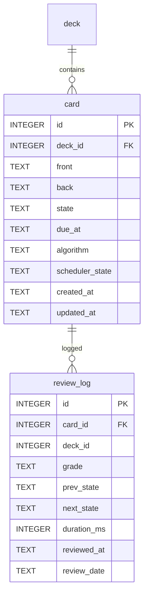

# Anki 卡片统计数据模块设计

本文给出「Anki 卡片统计数据」页面（替换现有「学习统计」页）的前后端设计，作为实现的依据。设计沿用
Anki / Agent 模块既有的 `interface / repository / service / controller` 分层与命名习惯，保证三个模块风格一致。

## 1. 设计目标

### 1.1 本阶段目标

把侧边栏的「学习统计」（`stats`）换成「Anki 卡片统计数据」，页面由四块组成：

1. **今日学习统计**：今日已完成卡片数、待完成卡片数、卡片总数，环形饼图；与首页「今日学习统计」共用同一数据口径。
2. **卡片数量**：按卡片自身状态划分的四类占比 —— 新卡 / 学习中 / 复习中 / 重新学习，饼图 + 图例表。
3. **复习行为历史**：按天聚合的复习次数条形图，支持 1 个月 / 3 个月 / 1 年 / 全部时间范围切换，
   并给出学习天数与平均值的四条统计脚注。
4. **新增卡片数量**：按天聚合的新增卡片条形图，同样支持范围切换，给出总数与日均。

卡片分类直接取自 `card.state` 的既有取值（`CardState`：`new / learning / review / relearning`），
不新增与调度算法耦合的字段；四类的展示名与 Anki 管理页保持一致（新卡 / 学习中 / 复习中 / 重新学习）。

为此需要补齐两类后端能力：

- **复习历史持久化**：新增 `review_log` 表，作答时写入一条记录，历史图表与「今日已完成」以它为唯一数据源。
- **统计查询服务**：新增 `statistics` 模块，提供今日进度、分类占比、复习历史、新增卡片的只读查询。

`card` 表不做结构变更，卡片相关的既有契约（`Card`、`CardQuery`、`ReviewOutcome`）保持现状。

### 1.2 本阶段不做

- **暂停 / 搁置与熟练度分级**：不引入「已暂停」「已搁置」「欠熟练」「已熟练」等分类。卡片分类只反映
  `card.state`，因此也不新增 `card` 列，不做与调度算法耦合的间隔字段贯通。
- **用时统计**：`review_log.duration_ms` 字段落库预留，但前端本阶段不采集、不展示作答耗时。
- **按牌组 / 按标签的统计维度**：所有统计均为全库口径，不做牌组过滤与下钻。
- **未来预测与保留率图表**：Anki 的「未来到期」「卡片难度」「复习间隔」等图表不在本阶段。
- **每日新卡上限**：「今日待完成」按全部未学习卡片计算，不引入每日新卡限量规则。

### 1.3 总体分层

```
src-tauri/src/
├── interface/statistics.rs    # 统计 DTO 与枚举
├── repository/statistics.rs   # 纯聚合 SQL，不做业务判断
├── service/statistics.rs      # 统计口径、补零、平均值与百分比计算
└── controller/statistics.rs   # Tauri 命令，仅做参数透传
```

依赖方向与既有模块一致：`controller -> service -> repository -> db`。
另外 `service/anki.rs` 的作答流程会写入 `review_log`，`repository/anki.rs` 因此增加复习记录的写入函数。
统计模块与 Anki 同域，统一返回 `AnkiError { code, message }`，避免前端出现两套错误类型。

---

## 2. 将实现的接口

### 2.1 通用约定

- DTO 使用 `serde`，字段序列化统一 `camelCase`，与 `src/types/` 保持一致；枚举使用 `snake_case`。
- **日期口径**：所有「天」均按**本地时区日期**（`YYYY-MM-DD`）切分。写入时由 `chrono::Local` 生成日期串，
  历史 `card.created_at` 这类 UTC 时间戳在 SQL 中用 `date(created_at, 'localtime')` 折算。
- **时间比较**：到期判断统一用 SQLite 的 `datetime(due_at) <= datetime(?1)`，不依赖字符串前缀比较。
- 图表横轴使用**距今天数**（`0` = 今天，`-N` = N 天前），与 Anki 原版一致，前端 hover 时展示具体日期。
- 范围的起点以「今天」为锚点向前推：1 个月 = 30 天、3 个月 = 90 天、1 年 = 365 天（均含今天）。

### 2.2 统计类型（interface/statistics.rs）

```rust
/// 图表时间范围。
#[derive(Serialize, Deserialize, Clone, Copy, PartialEq, Eq, Debug)]
#[serde(rename_all = "snake_case")]
pub enum TimeRange {
    LastMonth,        // 近 30 天
    LastThreeMonths,  // 近 90 天
    LastYear,         // 近 365 天
    All,              // 自首个有数据的日期起
}

/// 卡片分类，与 `CardState` 一一对应，顺序即图例顺序。
#[derive(Serialize, Deserialize, Clone, Copy, PartialEq, Eq, Debug)]
#[serde(rename_all = "snake_case")]
pub enum CardCategory {
    New,         // 新卡
    Learning,    // 学习中
    Review,      // 复习中
    Relearning,  // 重新学习
}

/// 今日学习统计（首页与统计页共用）。
pub struct TodayProgress {
    pub date: String,            // 本地日期 YYYY-MM-DD
    pub reviewed_cards: u32,     // 今日已作答的去重卡片数
    pub pending_cards: u32,      // 此刻仍需作答的卡片数
    pub total_cards: u32,        // 卡片总数
    pub new_remaining: u32,      // 其中新卡
    pub due_remaining: u32,      // 其中已到期需复习
    pub completion_percent: f64, // reviewed / (reviewed + pending)
}

/// 单个分类的数量与占比。
pub struct CardCategoryCount {
    pub category: CardCategory,
    pub label: String,   // 新卡 / 学习中 / 复习中 / 重新学习
    pub count: u32,
    pub percent: f64,    // 占 total 的百分比
}

/// 卡片数量分布。
pub struct CardBreakdown {
    pub total: u32,
    pub categories: Vec<CardCategoryCount>, // 固定 4 项，顺序与图例一致
}

/// 条形图的一天。
pub struct DailyCount {
    pub day: String,    // YYYY-MM-DD
    pub days_ago: i32,  // 0 = 今天，-N = N 天前
    pub count: u32,
}

/// 复习行为历史。
pub struct ReviewHistoryStats {
    pub range: TimeRange,
    pub days: Vec<DailyCount>,        // 范围内每一天，缺数据补 0
    pub total_reviews: u32,           // 总计 N 次复习
    pub studied_days: u32,            // 学习天数 X
    pub elapsed_days: u32,            // 总天数 Y
    pub studied_day_percent: f64,     // X / Y
    pub average_per_elapsed_day: f64, // 总计 / Y
    pub average_per_studied_day: f64, // 总计 / X
}

/// 新增卡片趋势。
pub struct AddedCardsStats {
    pub range: TimeRange,
    pub days: Vec<DailyCount>,
    pub total: u32,             // 总计 N 张卡片
    pub elapsed_days: u32,
    pub average_per_day: f64,
}
```

### 2.3 repository 接口

```rust
// repository/statistics.rs —— 只做聚合查询，返回原始计数
pub struct CategoryCounts { new, learning, review, relearning }  // u32

pub fn category_counts(conn: &Connection) -> Result<CategoryCounts, AnkiError>;
pub fn today_counts(conn: &Connection, now: &str)
    -> Result<TodayCounts, AnkiError>;   // reviewed_cards / new_remaining / due_remaining / total_cards
pub fn review_counts_by_day(conn: &Connection, from: &str) -> Result<Vec<(String, u32)>, AnkiError>;
pub fn studied_day_count(conn: &Connection, from: &str) -> Result<u32, AnkiError>;
pub fn added_counts_by_day(conn: &Connection, from: &str) -> Result<Vec<(String, u32)>, AnkiError>;
pub fn first_activity_day(conn: &Connection) -> Result<Option<String>, AnkiError>;

// repository/anki.rs —— 既有文件追加
pub struct ReviewLogEntry {
    pub card_id: i64,
    pub deck_id: i64,
    pub grade: CardGrade,
    pub prev_state: CardState,
    pub next_state: CardState,
    pub duration_ms: u32,
    pub reviewed_at: String,   // RFC3339（UTC）
    pub review_date: String,   // 本地日期 YYYY-MM-DD
}
pub fn insert_review_log(conn: &Connection, entry: &ReviewLogEntry) -> Result<(), AnkiError>;
pub fn deck_id_of(conn: &Connection, card_id: i64) -> Result<i64, AnkiError>;
pub fn today_local() -> String;
```

`interface/anki.rs` 不变：卡片分类只需要 `card.state`，`Card`、`CardQuery`、`ReviewOutcome`
与 `ScheduleRecord` 均无需新增字段，`list_cards` 的过滤条件也保持原样。

### 2.4 service 接口

```rust
// service/statistics.rs
pub struct StatisticsService { /* db: Arc<Mutex<Connection>> */ }

impl StatisticsService {
    pub fn new(db: Arc<Mutex<rusqlite::Connection>>) -> Self;

    pub fn today_progress(&self) -> Result<TodayProgress, AnkiError>;
    pub fn card_breakdown(&self) -> Result<CardBreakdown, AnkiError>;
    pub fn review_history(&self, range: TimeRange) -> Result<ReviewHistoryStats, AnkiError>;
    pub fn added_cards(&self, range: TimeRange) -> Result<AddedCardsStats, AnkiError>;
}
```

service 负责三件 repository 不做的事：**按范围生成连续日期序列并补零**、**计算百分比与平均值**、
**把 `CategoryCounts` 展开成固定 4 项的图例**。

### 2.5 Tauri 命令清单

统计（controller/statistics.rs）：

| 命令 | 参数（前端视角） | 返回 | 说明 |
| --- | --- | --- | --- |
| `stats_get_today_progress` | — | `TodayProgress` | 今日已完成 / 待完成 / 总数 |
| `stats_get_card_breakdown` | — | `CardBreakdown` | 四类占比 |
| `stats_get_review_history` | `range: TimeRange` | `ReviewHistoryStats` | 复习条形图 |
| `stats_get_added_cards` | `range: TimeRange` | `AddedCardsStats` | 新增条形图 |

四个命令彼此独立、无隐藏默认值，页面按卡片并行发起请求，范围切换只重取对应图表。
本阶段不新增任何 Anki 卡片写命令。

### 2.6 前端契约调整

1. 新增 `src/types/statistics.ts`、`src/services/statistics.ts`（`TimeRange`、`CardCategory` 及各 DTO）。
2. 新增 `src/mocks/statistics.ts`：生成近一年的复习与新增历史（含空白天），供开发态看图；在 `mocks/index.ts`
   注册 `stats_` 前缀分发。
3. `src/pages/Statistics.vue` 删除，新增 `src/pages/AnkiStatistics.vue`；`App.vue` 的 `stats` 视图指向新页面。
4. `Sidebar.vue` 中 `stats` 的标签由「学习统计」改为「Anki 统计」，图标沿用 `DataAnalysis`。
5. 新增 `src/components/charts/` 下的 ECharts 封装，供统计页复用（ECharts 6，按需引入）：
    - `src/components/charts/echarts.ts`：只注册用到的 `BarChart`、`PieChart`、`GridComponent`、
      `TooltipComponent`、`DataZoomComponent` 与 `CanvasRenderer`，控制打包体积。
    - `src/components/charts/EChart.vue`：通用渲染组件，接收 `option` 配置对象，挂载时 `init`、
      配置整体替换、以 `ResizeObserver` 跟随容器宽度、卸载时 `dispose`。
    - `src/components/charts/statisticsCharts.ts`：四张图表的配置生成器，统一负责 tooltip、坐标轴与缩放。
    - `src/components/charts/statisticsColors.ts`：蓝色主题配色常量。
   深浅色通过 `useTheme()` 的 `isDark` 切换两套调色板，与页面主题变量保持同一口径。
6. `Home.vue` 的「今日学习统计」环形图改用 `getTodayProgress()`，与统计页共用口径；`tasks` 部分保持
   `study_get_today_overview` 不变。
7. `types/study.ts` 删除 `StudyStatistics`、`StudyDay`、`StudySubject`，`services/study.ts` 删除
   `getStudyStatistics`，`mocks/study.ts` 删除对应假数据。
8. `types/anki.ts`、`services/anki.ts`、`mocks/anki.ts` 的卡片契约保持现状，`AnkiManager.vue` 不新增操作入口。

---

## 3. 数据表架构

### 3.1 迁移策略

沿用 `docs/database_migration.md` 的编号增量重放机制，新增 `000003.sql`（`user_version` 由 2 推进到 3），
负责建立 `review_log` 表。既有迁移文件不做修改。

### 3.2 ER 概览



### 3.3 迁移 000003.sql

```sql
-- Anki 卡片统计：复习历史表。
-- 本文件只在 user_version 从 2 推进到 3 时执行一次，无需幂等。

-- 复习历史：每次作答一条，是复习图表与「今日已完成」的唯一数据源。
CREATE TABLE review_log (
    id            INTEGER PRIMARY KEY AUTOINCREMENT,
    card_id       INTEGER NOT NULL,
    deck_id       INTEGER NOT NULL,           -- 记录作答时所在牌组，不设外键以保留历史
    grade         TEXT    NOT NULL
                  CHECK (grade IN ('again', 'hard', 'good', 'easy')),
    prev_state    TEXT    NOT NULL
                  CHECK (prev_state IN ('new', 'learning', 'review', 'relearning')),
    next_state    TEXT    NOT NULL
                  CHECK (next_state IN ('new', 'learning', 'review', 'relearning')),
    duration_ms   INTEGER NOT NULL DEFAULT 0, -- 预留：作答耗时
    reviewed_at   TEXT    NOT NULL,           -- RFC3339（UTC），精确时间
    review_date   TEXT    NOT NULL,           -- 本地日期 YYYY-MM-DD，按天聚合用
    FOREIGN KEY (card_id) REFERENCES card (id) ON DELETE CASCADE
);

CREATE INDEX idx_review_log_date ON review_log (review_date);
CREATE INDEX idx_review_log_card ON review_log (card_id);
```

`card` 表不改动，因此不需要新增卡片表上的索引。

### 3.4 统计口径

| 概念 | 口径 |
| --- | --- |
| 今日已完成 | `review_log` 中 `review_date = 今天` 的去重 `card_id` 数 |
| 今日待完成 | `state = 'new'` 的全部 + 非 new 且 `datetime(due_at) <= datetime(now)` 的全部 |
| 卡片总数 | `card` 表全部记录数 |
| 新卡 | `state = 'new'` |
| 学习中 | `state = 'learning'` |
| 复习中 | `state = 'review'` |
| 重新学习 | `state = 'relearning'` |
| 学习天数 | 范围内 `review_log` 的不重复 `review_date` 数 |
| 总天数 | 范围内包含今天在内的自然天数（1 月 = 30、3 月 = 90、1 年 = 365；全部时间 = 首个有数据的日期至今） |
| 平均（含未学习天数） | 总复习次数 / 总天数 |
| 平均（只计实际学习天数） | 总复习次数 / 学习天数，学习天数为 0 时取 0 |
| 新增卡片 | `card` 按 `date(created_at, 'localtime')` 聚合计数 |

四个分类互斥且覆盖全表，因此 `total` 等于四项之和，也等于 `COUNT(*)`。

两条需要留意的口径：

- **待完成是实时队列数**：`learning`/`relearning` 卡片答「重来」后数分钟内再次到期，会重新计入待完成，
  因此「已完成 + 待完成」可能大于卡片总数，这与 Anki 队列行为一致。
- **新增卡片以现存卡片为准**：删除卡片后其「新增」记录一并消失（`card` 不再是历史账本）；
  复习历史则独立保留，仅随卡片删除而级联清理。

---

## 4. 文件职责

| 文件 | 职责 |
| --- | --- |
| `src-tauri/migrations/000003.sql` | `review_log` 表与索引 |
| `src-tauri/src/interface/statistics.rs` | 统计 DTO 与枚举 |
| `src-tauri/src/repository/statistics.rs` | 分类计数、今日进度、按天聚合 |
| `src-tauri/src/repository/anki.rs` | 复习记录写入、`today_local` 与卡片所属牌组查询；既有卡片读写不变 |
| `src-tauri/src/service/statistics.rs` | 日期序列补零、百分比与平均值、分类展开 |
| `src-tauri/src/service/anki.rs` | 作答后写入 `review_log` |
| `src-tauri/src/controller/statistics.rs` | 四个统计命令 |
| `src-tauri/src/lib.rs` | `AppState` 增加 `statistics: StatisticsService` |
| `src/types/statistics.ts`、`src/services/statistics.ts` | 前端统计契约 |
| `src/mocks/statistics.ts` | 开发态统计假数据 |
| `src/pages/AnkiStatistics.vue` | 统计页面 |
| `src/components/charts/echarts.ts`、`EChart.vue` | ECharts 按需注册与通用渲染组件 |
| `src/components/charts/statisticsCharts.ts`、`statisticsColors.ts` | 四张图表的配置生成器与蓝色主题配色 |
| `src/components/layout/Sidebar.vue`、`src/App.vue`、`src/pages/Home.vue` | 导航与首页接入 |

---

## 5. 具体实现思路

### 5.1 卡片分类的 SQL

分类一次查完，SQL 只做条件计数，占比与补尾差放在 service：

```sql
SELECT
  SUM(CASE WHEN state = 'new' THEN 1 ELSE 0 END)        AS new,
  SUM(CASE WHEN state = 'learning' THEN 1 ELSE 0 END)   AS learning,
  SUM(CASE WHEN state = 'review' THEN 1 ELSE 0 END)     AS review,
  SUM(CASE WHEN state = 'relearning' THEN 1 ELSE 0 END) AS relearning
FROM card
```

占比以 `total` 为分母，四舍五入到 0.1%，并保证各项之和为 100.0%（余数补给数量最多的分类），
空库时全部为 0、不出现 `NaN`。

### 5.2 今日学习统计

`today_counts` 一条查询取待完成与总数，一次 `COUNT(DISTINCT card_id)` 取今日已完成，随后计算
`completion_percent = reviewed / (reviewed + pending)`（分母为 0 时取 0）。首页环形图用该比例绘制
已完成段，中心显示待完成数，脚注显示 `reviewed/total 完成任务` 与 `total 卡片总数`；
统计页第一张卡片复用同一接口。

### 5.3 复习行为历史

1. 由 `range` 决定起点：今天减去 29 / 89 / 364 天；`All` 时取 `review_log` 与「首个新增卡片日期」的较早者。
2. repository 返回范围内有数据的天与计数，service 用 `chrono::Local` 从起点到今逐日生成 `DailyCount` 并补零。
3. 学习天数取 `studied_day_count`，四条脚注按 3.4 的口径计算。
4. `days_ago` 由 service 计算，前端把负数直接映射到横轴，不需要再算日期差。

### 5.4 新增卡片趋势

与 5.3 结构一致，数据源改为 `card.created_at`（`date(created_at, 'localtime')`），
统计脚注为「总计 N 张卡片」与「平均 x 张/天」。

### 5.5 作答写入复习记录

`AnkiService::grade_card` 在 `save_schedule` 成功后追加一条 `review_log`：

- `prev_state` 取作答前的 `state`，`next_state` 取 `decision.state`，
  `reviewed_at` 为 `Utc::now().to_rfc3339()`，`review_date` 为同一时刻的 `Local` 日期串，
  `duration_ms` 缺省 0。
- 写入与调度更新共用同一把连接锁与同一个事务，卡片不存在或调度失败时不产生记录。
- `reset_card` 不写记录：重置是管理动作，不计入复习行为。
- 记录的构造通过 `outcome_of` 回读卡片，保证返回值与库中状态一致。

### 5.6 前端页面与图表

- 页面进入时并行发起 `stats_get_today_progress`、`stats_get_card_breakdown`、
  `stats_get_review_history('last_year')`、`stats_get_added_cards('last_year')`，范围选项默认「1 年」。
- 四张图统一由 `EChart.vue` 渲染，配置由 `statisticsCharts.ts` 生成：
  - `todayDonutOption`：今日「已完成 / 待复习」两段的环形图，扇形角度严格等于两者之比（`已完成 / （已完成 + 待复习）`）；数据全空时显示底环。
  - `cardBreakdownOption`：四类状态占比环形图，tooltip 展示「数量（百分比）」；计数为 0 的分类不占扇形，
    相邻扇形用 1px 卡片同色描边分隔。
  - `reviewBarOption` / `addedBarOption`：按天柱状图，圆角柱顶 + 纵向渐变，横轴为距今天数、
    纵轴 `minInterval: 1`，tooltip 用 `axisPointer: shadow` 并回显真实日期；
    天数超过 60 天时才挂 `dataZoom`（滚轮缩放 + 底部滑块），避免柱子被压成细线。
- 扇形不使用 `itemStyle.borderRadius`：ECharts 在圆角半径超过弧长时会把扇形压成圆点，
  小占比的分类就不再是按比例画出的弧（实测占比 0.99% 时外弧半径由 82.7px 塌缩到 2.5px，0.20% 时塌缩到 0.5px）。
  描边同理只取 1px，避免盖住占比极低的细扇形。
- 范围切换只重取对应图表的接口。
- 图表配色与页面主题变量对齐（`--learning-text`、`--learning-text-muted`、`--learning-border`、
  `--learning-border-soft`、`--learning-surface`），深浅色各一套调色板。
- 配色写入 `src/components/charts/` 的调色常量：

  | 分类 | 颜色 |
  | --- | --- |
  | 新卡 | `#1d4ed8` |
  | 学习中 | `#5b9cf8` |
  | 复习中 | `#287df5` |
  | 重新学习 | `#0f7fb8` |

  配色全部取自应用蓝色主题（`--learning-primary: #287df5`）的冷色阶，不使用参考图的绿 / 橙 / 红。
- 其余图表用色：

  | 图表 | 颜色 |
  | --- | --- |
  | 今日环形图：已完成 / 待复习 | `#287df5` / `#9db2cf` |
  | 复习次数柱状图渐变（上浅下深） | `#5b9cf8` → `#287df5` |
  | 新增卡片柱状图渐变（上浅下深） | `#8ab8fb` → `#5b9cf8` |

- 页面根元素撑满内容区并自身滚动（`height: 100%` + `overflow-y: auto`）：`el-main` 是 `overflow: hidden` 的块级容器，根元素必须带确定高度，否则内容会被裁掉而无法上下滚动。
- 页面沿用既有 `--learning-*` 主题变量与卡片样式，深浅色模式自动适配。

### 5.7 事务与启动接线

- `grade_card` 中「更新调度 + 写复习记录」置于同一事务，两者同成同败。
- `lib.rs` 的 `AppState` 增加 `statistics: StatisticsService`，与 `AnkiService` 共享同一个
  `Arc<Mutex<Connection>>`；统计服务无状态、只读，不持有调度器与配置句柄。
- `controller_handlers!` 汇总四个 `stats_*` 命令。

### 5.8 错误码

沿用 `AnkiError`：

| code | 场景 |
| --- | --- |
| `db` | 聚合查询或写入失败 |
| `internal` | 数据库连接不可用 |

### 5.9 测试

- 迁移：`000003.sql` 后 `user_version = 3`，`review_log` 与两个索引存在，`card` 列未变。
- repository：分类计数覆盖四类与空表、今日进度覆盖到期与未到期、按天聚合覆盖跨天与空数据。
- service：补零后的 `days` 长度与 `days_ago`、百分比与平均值（学习天数为 0、范围内无数据）、
  图例四项之和等于 `total`。
- 作答链路：`grade_card` 后 `review_log` 恰好多一条，`prev_state`/`next_state` 与卡片状态一致；
  `reset_card` 不产生记录；`grade_card` 失败时不产生记录。
- 前端：mock 数据覆盖空库与有数据两种形态，验证图表、图例占比与范围切换。

### 5.10 实施顺序

1. `migrations/000003.sql` 与 `repository/db.rs` 迁移测试。
2. `interface/statistics.rs` 统计类型。
3. `repository/statistics.rs` 聚合查询与单元测试。
4. `repository/anki.rs` 的 `insert_review_log`、`deck_id_of` 与 `today_local`。
5. `service/anki.rs` 作答链路写入复习记录。
6. `service/statistics.rs` 口径计算与用例测试。
7. `controller/statistics.rs`、`AppState` 与 `controller_handlers!` 接线。
8. 前端 `types/statistics.ts`、`services/statistics.ts`、`mocks/statistics.ts`。
9. `components/charts/` 的 ECharts 封装、`pages/AnkiStatistics.vue`、`Sidebar.vue`、`App.vue`、`Home.vue` 接入。
10. 清理 `pages/Statistics.vue` 与 `study` 侧旧统计契约。

---

## 6. 口径约定

1. **参考图只作样式参考**：卡片分类、范围选项等按本仓库后端的既有内容与 Anki 常规设定确定，
   不照搬参考图中的具体数据。
2. **卡片分类只用 `card.state` 的四个取值**：新卡 / 学习中 / 复习中 / 重新学习，不引入暂停、搁置与熟练度分级。
3. **「今日待完成」计入新卡**：`pending_cards = new_remaining + due_remaining`。
4. **范围选项**：1 个月 / 3 个月 / 1 年 / 全部时间，分别对应近 30 / 90 / 365 天（含今天）；
   「全部时间」自首个有数据的日期起。